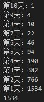

# C语言

## C语言介绍
- C语言是一种**面向过程**的计算机编程语言，与C++、Java等面向对象编程语言有所不同。
- C语言的设计目标是以一种简易的方式编译、处理低级存储器、仅产生产生少量机器码以及不需要任何运行环境支持便可运行的编程语言。
- C语言不但执行效率高而且可移植性好，可以用来开发应用软件、驱动、操作系统等。


## C语言的具体结构

### hello world
``` c
#include <stdio.h>
int main(){
    printf("hello world!");
    return 0;
}
```

一个C程序是由若干`头文件`和`函数`组成，如上述的**hello world**代码，是由头文件`#include <stdio.h>`和主函数部分组成。
- `#include <stdio.h>`是一条预处理命令，其中`#include`是文件包含命令，用来引入对应的头文件（.h文件），处理过程类似于COPY一样插入头文件到命令所在位置。
- 函数部分就是实现代码逻辑的一个小的**单元**。

## C基本语法
### main函数
一个C程序有且只有一个**主函数**，也就是main函数。
- C程序就是执行主函数里面的代码。
- `main`前的`int`是主函数的类型。
### 分号
在C程序中，分号是语句结束符。也就是说，每个语句必须以分号结束。它表明一个逻辑实体的结束。
### 注释
- // 单行注释
- /* 多行
- &nbsp;&nbsp;&nbsp;注释*/
  
注释内不能嵌套注释，注释不能出现在字符串中。
### 标识符
标识符是数字`（0~9）`、字母`（a~z、A~Z）`、下划线`_`组成的字符串。
-  第一个字符必须是字母或下划线。
-  严格区分大小写。
-  不为C语言关键字。
### 关键字
关键字是由系统定义的，不能重新做其他定义的字符，且每个关键字已经赋予了不同的意义。
以下是较不常见的关键词：
|关键字|	说明
|---|---|
|auto|	声明自动变量
|const|	定义常量，如果一个变量被 const 修饰，那么它的值就不能再被改变
|continue|	结束当前循环，开始下一轮循环
|default|	开关语句中的"其它"分支
|enum	|声明枚举类型
|extern|	声明变量或函数是在其它文件或本文件的其他位置定义
|goto	|无条件跳转语句
|register|	声明寄存器变量
|signed	|声明有符号类型变量或函数
|sizeof|计算数据类型或变量长度（即所占字节数）
|static	|声明静态变量
|struct|	声明结构体类型
|typedef|	用以给数据类型取别名
|unsigned|	声明无符号类型变量或函数
|union|	声明共用体类型
|void	|声明函数无返回值或无参数，声明无类型指针
|volatile|	说明变量在程序执行中可被隐含地改变
## 变量
变量就是可以变化的量，且每个变量都由一个名字（标识符）。
- 变量占据内存中一定的存储单元。
- 使用变量之前必须先定义变量——数据类型、变量名（标识符）。
- 定义变量要建立存储空间。
- 注意使用extern关键词是声明，不是定义。
  ``` c
  extern int num; //声明，不是定义
  int num;        //声明，也是定义
  ```
- 先声明再赋值、声明的同时赋值。
  ``` c
  int num;        //定义一个整型变量，变量名为num
  num = 1;        //给num变量赋值1
  int sum= 0;     //定义整型变量sum的同时赋值0
  ```
## 数据类型
在C语言中，数据类型指的是用于声明不同类型的变量或函数的一个广泛的系统。变量的类型决定了变量存储占用的空间，以及如何解释存储的位模式。
### 数据类型分类
数据类型可分为：
- 基本数据类型
- 构造数据类型
- 指针类型
- 空类型

基本数据类型包括**整数类型**和**浮点类型**。
### 整数类型
|类型|存储大小|值范围
|---|---|---|
|char|1 字节|-128 到 127 或 0 到 255
|unsigned char|	1 字节|0 到 255
|signed char|1 字节	|-128 到 127
|int|2 或 4 字节|-32,768 到 32,767 或 -2,147,483,648 到 2,147,483,647
|unsigned int|2 或 4 字节|0 到 65,535 或 0 到 4,294,967,295
|short|2 字节|-32,768 到 32,767
|unsigned short|2 字节|0 到 65,535
|long|4 字节|-2,147,483,648 到 2,147,483,647
|unsigned long|4 字节|0 到 4,294,967,295
- 可用**sizeof(type)**得到对象或类型的存储字节大小。
### 浮点类型
|类型	|存储大小	|值范围	|精度
|---|---|---|---|
|float	|4 字节	|1.2E-38 到 3.4E+38	|6位有效位
|double	|8 字节	|2.3E-308 到 1.7E+308	|15位有效位
|long double	|16 字节	|3.4E-4932 到 1.1E+4932	|19位有效位
### 空类型——关键字void
void类型，代表任意类型，而不是空的意思。任意类型的意思是说它的类型是未知的，是还没指定的。
### 自动类型转换
数据类型存在自动转换的情况。
- 字节小的可以向字节大的自动转换，但字节大的不能向字节小的自动转换。
- `char`可以转换为`int`，`int`可以转换为`double`，`char`可以转换为`double`。
  
在赋值运算中，赋值号两边的数据类型不同时，需要把右边表达式的类型转换为左边变量的类型，这可能会导致数据失真，或者精度降低；所以说，自动类型转换并不一定是安全的。对于不安全的类型转换，编译器一般会给出警告。
### 强制类型转换
强制类型转换是通过定义类型转换运算来实现的。一般形式为：`(数据类型) (表达式)`。
- 数据类型和表达式都必须加括号。
- 转换后不会改变原数据的类型和变量值，只在本次运算中**临时转换**。
- 强制转换后的运算结果不遵循四舍五入原则。
## 常量
在程序执行过程中，值不发生改变的量称为**常量**。
常量可分为**直接常量**和**符号常量**。
### 直接常量
直接常量也称为**字面量**，是可以直接拿来使用，无需说明的量。
- 整型常量：-1、0、1
- 实型常量：3.33、-3.33
- 字符常量：'a'、'B'
- 字符串常量："hello world"
### 符号常量
符号常量是用一个**标识符**来表示的常量，在使用之前必须先定义。
有以下两种表示方式：
- #define 标识符 常量值（无分号）
- const 数据类型 标识符 = 常量值;
``` c
#define P 3.14  

const int num = 10;
```
符号变量不可被改变。
### 转义序列码
在C语言中，有一些特定的字符，当它们前面有反斜杠时，它们就具有特殊的含义。
|转义序列|	含义
|---|---|
|\'|	' 字符
|\b|	退格键
|\f|	换页符
|\n|	换行符
|\r|	回车
|\t|  水平制表符tab
## 存储类
存储类定义 C 程序中变量/函数的范围（可见性）和生命周期。存储类放置在所修饰类型之前。
可用的存储类：

- extern:提供一个全局变量的引用，全局变量对所有的程序文件都是可见的。
- auto：局部变量默认定义的存储类，auto只能用于函数中，只能修饰局部变量。
  ``` c
  {
    int n;
    auto int n; //两个变量带有相同的存储器
  }
  ```
- register：可加快修饰变量的存储速度，存放在CPU的寄存器中。
- static：可修饰变量和函数。
  ``` c
  #include <stdio.h>

  void test(void);

  static int count = 10;  //全局变量static是默认的

  int main(){
    while(count--){
      test();
    }
    return 0;
  }

  void test(void){
    static int a = 1;     //只初始化一次，a不会被重置为1
    a++;
    printf("%d",a);
  }
  ```
## 运算符
运算符是一种告诉编译器执行特定的数学或逻辑操作的符号。
### 运算符分类
- 算数运算符
- 关系运算符
- 逻辑运算符
- 赋值运算符
- 三目运算符
### 算数运算符
加减乘除、自增自减、取余数
- 除法运算：两个数是整数，结果也为整数。有一个是小数，则结果为小数。
- 取余运算：只适用于两个整数，运算后的符号取决于被取余数的符号。
### 关系运算符

### 逻辑运算符

### 赋值运算符
- 简单赋值运算符：= 
- 复合赋值运算符： +=、-=、*=、/=、%=
### 三目运算符
```
表达式1 ? 表达式2 : 表达式3;
```
### 运算符优先级

## 语句
C语言有**判断语句**和**循环语句**
### 判断语句
- if……else……语句
- switch语句
- 三目运算符
### 循环语句
- for循环
- while循环
- do……while循环
### 循环控制语句
- break语句
- continue语句
- goto语句（一般不用）
## 函数
### 自定义函数
自定义函数的一般形式：
``` 
[数据类型] 函数名称([参数]){
  执行代码块;
  return (表达式);
}
```
- [ ]中内容可以省略，数据类型省略，默认是`int`类型；参数省略默认是无参函数。
- 函数命名遵循标识符命名规范。
- 自定义函数一般放`main`函数之前，若放在后面则需要先声明自定义函数。
  声明格式：`[数据类型说明] 函数名称([参数]);`
### 函数调用
函数调用的一般形式：
``` 
函数名称([参数]);
```
### 参数
在函数中需要函数参数的称为**有参函数**，反之为**无参函数**。
函数的参数分为**形参**和**实参**两种。
- 形参是定义函数时使用的参数，目的是接收该函数被调用时传入的参数。
- 实参是调用时传递该函数的参数。
- 进行函数调用时，实参必须为**确定的值**。
- 在参数传递时，实参和形参在数量上、类型上、顺序上需要严格一致。
  ``` c
  #include <stdio.h>

  int add(int x){         //x为形参
    return x++;
  }

  int main(){
    int x = 1;            //定义变量x并赋值
    printf("%d",add(x));  //x为实参
    return 0;
  }
  ```
### 函数的返回值
函数的**返回值**是指函数被调用之后，执行函数体中的程序段所取得的并返回给主调函数的值。
- 函数的值通过`return`语句返回给主调函数。
- 返回值的类型和函数的类型应保持一致。
- `void`类型的函数没有返回值，若有也只起到结束函数运行的作用。格式为：`return;`
### 递归函数
递归就是一个函数在它的函数体内调用它自身。
- 递归必有结束条件。

递归函数特点：
- 每一级函数调用时拥有自己的变量。
- 每次调用都会有一次返回。
- 递归函数中，位于递归调用前的语句和各级被调用函数具有相同的执行顺序。
- 递归函数中，位于递归调用后的语句的执行顺序和各个被调用函数的顺序相反。
- 递归函数中必须有终止语句。

`例：猴子第一天摘下N个桃子，当时就吃了一半，还不过瘾，就又多吃了一个。第二天又将剩下的桃子吃掉一半，又多吃了一个。以后每天都吃前一天剩下的一半零一个。到第10天在想吃的时候就剩一个桃子了,问第一天共摘下来多少个桃子？并反向打印每天所剩桃子数。`
``` c
#include <stdio.h>

int aaa(int n){                     //n可以看成层号
  int num;                          //放置结果
    if (n==10)                    
        return 1;                   //终止语句
    else
        num = (aaa(n+1) + 1)*2;     //递归调用 
        return num;
} 
// a(1)=(a(2)+1)*2 a(2)=(a(3)+1)*2 a(3)=1   //每一层的关系
int main(){
    printf("%d",aaa(1));
    return 0;
}
```
运行结果如图：

### 函数作用域
作用域是程序定义变量所存在的区域，超过该区域不能被访问。
- 在某个函数或块的内部声明的变量称为**局部变量**。它们只能被该函数或该代码块内部的语句使用。局部变量在函数外部是不可知的。
- **全局变量**是定义在函数外部，通常是在程序的顶部。全局变量在整个程序生命周期内都是有效的，在任意的函数内部能访问全局变量。
- 函数的参数，**形参**被当作函数内的局部变量，与全局变量同名的话会被优先使用。
- 当局部变量被定义时，系统不会对其初始化。
- 定义全局变量时，系统会自动对其初始化。
  
  |数据类型|	初始化默认值
  |---|---|
  |int|	0
  |char|	'\0'
  |float|	0
  |double|	0
  |pointer|	NULL
## 数组
C语言支持数组数据结构，它可以存储一个固定大小的相同类型元素的顺序集合。
### 初始化数组
- 数组下标均以0开始；
- 在初始化过程中，元素个数小于数组的长度时，多余的数组元素初始化为0；
- 没有初始化，静态（static）和外部（extern）类型的数组元素初始化元素为0，自动（auto）类型的数组的元素初始化值不确定。

简单获取数组长度：`int length = sizeof(arr)/sizeof(arr[0]);`

### 数组传递到函数
函数参数：
- 指针
- 已定义大小的数组
- 未定义大小的数组
### 多维数组
二维数组、三维数组。
- 二维数组定义的时候，可以不指定行的数量，但是必须指定列的数量。
- 多维数组遍历需要嵌套循环。
### 字符串与数组
通过数组定义字符串：
`char 字符串名称[长度] = "字符串内容";`
`char 字符串名称[长度] ={'字符1','字符2',……,'\0'};`
- [ ]的长度可以省略不写；
- 第二种方法的最后一个元素必须为'\0','\0'表示字符串的结束标志；
- 第二种方式不能写中文；
- 输出字符串可以`printf("%s",字符串名称);`或`puts(字符串名称);`。
### 字符串函数

|函数|目的
|---|---|
|strcpy(s1, s2);|复制字符串 s2 到字符串 s1。
|strcat(s1, s2);|连接字符串 s2 到字符串 s1 的末尾。
|strlen(s1);|返回字符串 s1 的长度。
|strcmp(s1, s2);|如果 s1 和 s2 是相同的，则返回 0；如果 s1<s2 则返回小于 0；如果 s1>s2 则返回大于 0。
|strchr(s1, ch);|返回一个指针，指向字符串 s1 中字符 ch 的第一次出现的位置。
|strstr(s1, s2);|返回一个指针，指向字符串 s1 中字符串 s2 的第一次出现的位置。

## 枚举
枚举是C语言的一种基本数据类型，让数据更简洁易读。
``` c
enum DAY{     
  MON=1,TUE,WED,THU,FRI,SAT,SUN
};
```
- 第一个枚举成员默认值为 0
- 后续枚举成员的值在前一个成员上加 1

定义枚举变量：
``` c
enum DAY{     
  MON=1,TUE,WED,THU,FRI,SAT,SUN
} day;
```
``` c
enum DAY{     
  MON=1,TUE,WED,THU,FRI,SAT,SUN
};
enum DAY day;
```
``` c
enum {     
  MON=1,TUE,WED,THU,FRI,SAT,SUN
} day;
```
## 指针
指针也就是内存地址，指针变量是用来存放内存地址的变量。
使用指针前要声明：`type *p;`
### 指针简单使用
``` c
#include <stdio.h>
int main(){
  int a=1;
  int *p;
  p=&a;

  printf("变量a的地址：%p\n",&a);
  printf("p变量存储的地址：%p\n",p);
  printf("p变量的值：%d\n",*p);

  return 0;
}
```
### 指针算数运算
``` c
int *p;
int a[]={1,2,3};
p=&a;       //默认为p=&a[0]
p++;        //指向下一个位置a[1]
p--;        //指向前一个位置a[0]       
```
- 指针的每一次递增，指向下一个元素的存储单元。
- 指针的每一次递减，指向前一个元素的存储单元。
- 指针在递增和递减时跳跃的字节数取决于指针所指向变量**数据类型长度**，比如 int 就是 4 个字节。
### 指针数组和数组指针
- 指针数组：”指针”修饰这个数组，意思是说这个数组的所有元素都是指针类型。
  `char *p[4]={1,2,3,4};`
- 数组指针：”数组”修饰这个指针，意思是说这个指针存放着一个数组的首地址。
  `char (*p)[4];`
## 结构体
C 数组允许定义可存储**相同类型数据项**的变量，**结构**是 C 编程中另一种用户自定义的可用的数据类型，它允许您存储**不同类型的数据项**。
``` c
struct tag {        //tag是结构体标签
    member-list     
    member-list 
    member-list  
    ...
} variable-list ;  
```
- 结构体可以作为函数参数
  ```c
  struct Books
  {
    char  title[50];
    char  author[50];
    char  subject[100];
    int   book_id;
  };
  
  /* 函数声明 */
  void printBook( struct Books book );
  ```
- 指向结构的指针
  ```c
  struct Books *struct_pointer;
  struct_pointer = &Book1;
  struct_pointer->title;    //访问结构的成员需使用->运算符
  ```
### 共用体
共用体是一种特殊的数据类型，允许您在相同的内存位置存储不同的数据类型。您可以定义一个带有多成员的共用体，但是任何时候**只能有一个成员带有值**。
``` c
union [union tag]
{
   member definition;
   member definition;
   ...
   member definition;
} [one or more union variables];
```
- 共用体占用的内存应为足够存储共用体中最大的成员。
- 使用共用体一个时间给予一个变量。
### typedef关键字
- typedef 关键字，可以使用它来为类型取一个新的名字。
  ``` c
  typedef unsigned long int LONG;
  LONG a; 
  ```
- typedef 来为用户自定义的数据类型取一个新的名字。
  ``` c
  typedef struct Books
  {
    char  title[50];
    char  author[50];
    char  subject[100];
    int   book_id;
  } Book;
  int main(){
    Book book;
    return 0;
  }
  ```
## 输入&输出
标准输入：stdin（键盘）
标准输出：stdout（屏幕）
### getchar() & putchar() 函数
- getchar()同一时间只能读取一个单一的字符。
- putchar()同一时间只会输出一个单一的字符。
### gets() & puts() 函数
字符串输入输出。
- char *gets(char *s) 函数从 stdin 读取一行到 s 所指向的缓冲区，直到一个终止符'\0'或 EOF。
- int puts(const char *s) 函数把字符串 s 和一个尾随的换行符写入到 stdout。
### scanf() 和 printf() 函数
- 可以指定 %s、%d、%c、%f 等来输出或读取字符串、整数、字符或浮点数。
## 文件读写
### 打开文件
``` c
FILE *fopen( const char *filename, const char *mode );
```
- filename 是字符串，用来命名文件，
- 访问模式 mode 的值可以是下列值中的一个:
  
|模式|描述
|---|---|
|r|	以“只读”方式打开文件。只允许读取，不允许写入。文件必须存在，否则打开失败。
|w|	以“写入”方式打开文件。如果文件不存在，那么创建一个新文件；如果文件存在，那么清空文件内容（相当于删除原文件，再创建一个新文件）。
|a|	以“追加”方式打开文件。如果文件不存在，那么创建一个新文件；如果文件存在，那么将写入的数据追加到文件的末尾（文件原有的内容保留）。
|r+|	以“读写”方式打开文件。既可以读取也可以写入，也就是随意更新文件。文件必须存在，否则打开失败。
|w+|	以“写入/更新”方式打开文件，相当于`w`和`r+`叠加的效果。既可以读取也可以写入，也就是随意更新文件。如果文件不存在，那么创建一个新文件；如果文件存在，那么清空文件内容（相当于删除原文件，再创建一个新文件）。
|a+|	以“追加/更新”方式打开文件，相当于`a`和`r+`叠加的效果。既可以读取也可以写入，也就是随意更新文件。如果文件不存在，那么创建一个新文件；如果文件存在，那么将写入的数据追加到文件的末尾（文件原有的内容保留）。
- 打开方式默认为**文本文件**`"t"`,也可以用二进制文件方式`"b"`打开。
### 关闭文件
``` c
int fclose(FILE *fp);
```
- 文件正常关闭，fclose()返回值为0，返回非零值则有误。