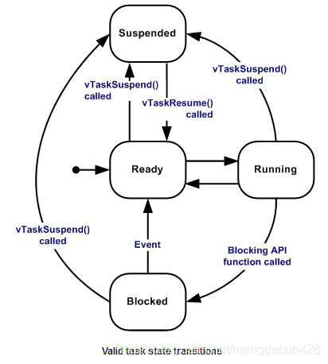
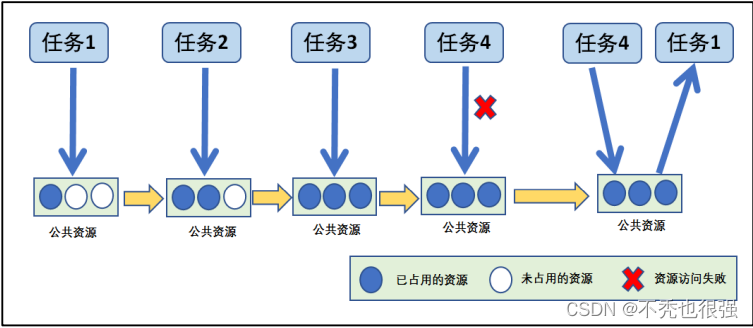
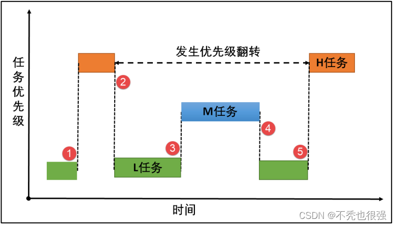
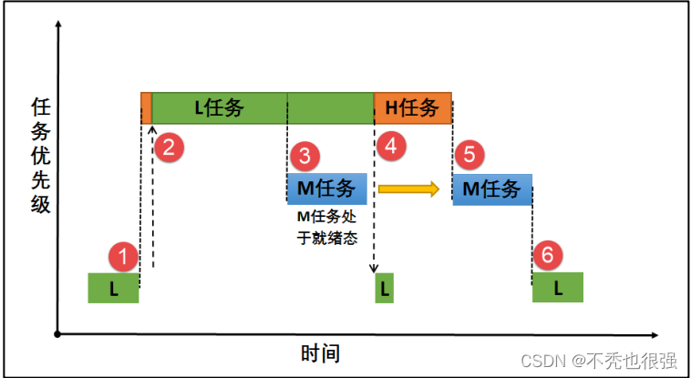
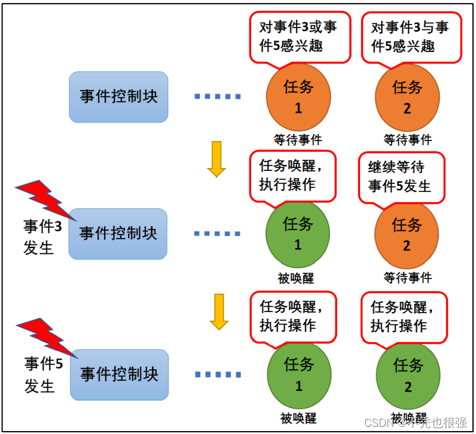

# FreeRTOS
## 简介
FreeRTOS，全称Free Real Time Operating System，即免费的实时操作系统。相比于计算机中用到的Windows，MacOS，Linux等操作系统，实时操作系统(RTOS)是一种轻量级的操作系统，适用于嵌入式硬件中，用于解决单片机类裸机轮询方式在处理多个任务时的实时性不高的问题。

目前的实时操作系统有好多种，除FreeRTOS外，还有μCOS、RT-Thread、RTX、Alios Things、Huawei LiteOS等。

### 与裸机系统的区别
实时操作系统(RTOS)的主要特点是可以实现多任务，与多任务系统相对的是裸机系统。
#### 裸机系统
- 裸机系统就是最初我们学习单片机编程时接触的那种编程方式，main函数中一个while大循环依次处理各个模块的任务，对于需要及时检测的事件会使用中断。

#### 多任务系统
- 多任务系统是将各个处理模块编写为单独的任务，**每个任务本身是个无限循环**，程序运行初期会创建各个子任务，通过**任务调度**的方式，利用各任务的阻塞时刻不断切换运行各个任务，达到一种看起来是多个任务在同时运行的一种效果。并且，通过中断标志以及任务间通信的相关机制，可以实现任务之间的快速响应。

### FreeRTOS特点
- 使用免费！
- 系统简单小巧、文件数量少、通常情况下内核占用4~9k字节空间
- 抢占式内核
- 代码主要由C编写，可移植性高，已实现在30多种架构的芯片上移植
- 任务与任务，任务与中断间的通信方式包括：信号量、消息队列、事件标志组、任务通知
- 具有优先级继承特性的互斥信号令，避免优先级反转问题
- 高效的软件定时器

## 源码目录结构
以FreeRTOS v9.0.0版本为例

在FreeRTOS文件夹中主要关注source文件夹，这里是FreeRTOS的全部源码，包括6个c文件和include文件夹下的多个h文件。另外，在portable文件夹下，是针对不同硬件平台的单独区分使用的代码，目前考虑使用Keil开发STM32F103，所以portable文件夹只需使用RVDS的ARM_CM3以及MemMang。

关于各个c文件的主要用途：

- port.c : 针对不同硬件平台的接口
- heap_4.c : 内存管理相关
- croutine.c : 协程相关
- event_groups.c : 事件标志组相关
- list.c : 列表，FreeRTOS的一种基础数据结构
- queue.c : 队列相关
- tasks.c : 任务创建、挂起、恢复、调度相关
- timers.c : 软件定时器相关

还需要用到一个**FreeRTOSConfig.h**，该文件中通过各种宏定义的方式来配置FreeRTOS需要使用哪些资源。

## 任务创建
- 外部硬件初始化
  `void xxx_Init()`
- 定义任务函数
```
void xxx_Task(void* parameter)
{
    while (1)
    {

    }
}
```
- 空闲任务与定时器任务堆栈函数实现
- 定义任务栈
  `StackType_t xxx_Task_Stack[yyy];`
- 定义任务控制块
  `StaticTask_t xxx_Task_TCB;`

- 创建任务
```
/* 创建 任务 */
xTaskCreate(	TaskFunction_t pxTaskCode,  //任务函数
							const char * const pcName,//任务名称
							const uint16_t usStackDepth,//任务堆栈大小
							void * const pvParameters,//传递给任务函数的参数
							UBaseType_t uxPriority,//任务优先级
							TaskHandle_t * const pxCreatedTask )//任务句柄 
```
```
/* 创建 静态任务 */
TaskHandle_t xTaskCreateStatic(	TaskFunction_t pxTaskCode,//任务函数
                            const char * const pcName,//任务名称
                            const uint32_t ulStackDepth,//任务堆栈大小
                            void * const pvParameters,//传递给任务函数的参数
                            UBaseType_t uxPriority,//任务优先级
                            StackType_t * const puxStackBuffer,//任务堆栈
                            StaticTask_t * const pxTaskBuffer )//任务控制块
```
- 启动任务：
  `  vTaskStartScheduler();   /* 启动任务，开启调度 */`

！注意事项：
- 需要在**FreeRTOSConfig.h** 中宏定义  
```
    #define xPortPendSVHandler 	PendSV_Handler
    #define vPortSVCHandler 	SVC_Handler
```
- 在使用静态创建任务的时候必须要将 **FreeRTOSConfig.h** 中 的 **configSUPPORT_STATIC_ALLOCATION** 宏配置为 1。
`#define configSUPPORT_STATIC_ALLOCATION 1`

## 任务管理
RTOS 系统的核心就是任务管理。

### 任务状态
FreeRTOS系统中的每个任务都有多种运行状态

**运行态（Running）**
- 当一个任务实际执行时，它就处于运行态。它目前正在使用处理器。如果RTOS运行的处理器只有一个内核，那么在任何给定的时间内只能有一个任务处于运行态。

**就绪态(Ready)**
- 就绪任务是指能够执行，但是还没有执行的任务（不是阻塞态或挂起态），因为有一个优先级相同或更高的任务正在运行。

**阻塞态(blocked)**
- 如果任务正在等待一个临时或外部事件，则任务处于阻塞态。举一个例子，任务调用vTaskDelay()函数后，任务进入阻塞态，直到延时周期结束-这是一个临时事件。任务可以阻塞等待一个队列、信号量、事件组、通知或信号量事件。处于阻塞状态的任务通常有一个“超时”周期，在此之后任务将超时并被解除阻塞，即使任务等待的事件尚未发生。处于阻塞态的任务不占用任何处理器的时间，且不会被选择进入运行态。

**挂起态(Suspended)**
- 与处于阻塞态的任务一样，处于挂起态的任务同样不能被选择进入运行态。但是处于挂起态的任务没有超时时间。相反，任务只有通过调用API函数vTaskSuspend() and xTaskResume() 显示的进入或退出挂起态。



### 任务函数

**任务挂起函数   vTaskSuspend()**
- 挂起指定任务。被挂起的任务绝不会得到 CPU 的使用权，不管该任务具有什么优先级。 任务可以通过调用 vTaskSuspend()函数都可以将处于任何状态的任务挂起，被挂起的 任务得不到 CPU 的使用权，也不会参与调度，它相对于调度器而言是不可见的，除非它从 挂起态中解除。

**任务恢复函数     vTaskResume()**
- 任务恢复就是让挂 起的任务重新进入就绪状态，恢复的任务会保留挂起前的状态信息，在恢复的时候根据挂起时的状态继续运行。如果被恢复任务在所有就绪态任务中，处于最高优先级列表的第一位，那么系统将进行任务上下文的切换。

**任务删除函数   vTaskDelete()**
- 用于删除一个任务。当一个任务删除另外一个任务时，形参为要删除任 务创建时返回的任务句柄，如果是删除自身， 则形参为 NULL。 要想使用该函数必须在 FreeRTOSConfig.h 中把 **INCLUDE_vTaskDelete 定义为 1**，删除的任务将从所有就绪，阻塞， 挂起和事件列表中删除。

**任务延时函数    vTaskDelay()**
- vTaskDelay()在我们任务中用得非常之多，每个任务都必须是死循环，并且是必须要有 阻塞的情况，否则低优先级的任务就无法被运行了。要想使用 FreeRTOS 中的 vTaskDelay() 函数必须在 FreeRTOSConfig.h 中把 INCLUDE_vTaskDelay 定义为 1 来使能。

**vTaskDelayUntil()**
- 在 FreeRTOS 中，除了相对延时函数，还有绝对延时函数 vTaskDelayUntil()，这个绝 对延时常用于较精确的周期运行任务，比如我有一个任务，希望它以固定频率定期执行， 而不受外部的影响，任务从上一次运行开始到下一次运行开始的时间间隔是绝对的，而不 是相对的。

## 消息队列
队列是为了任务与任务、任务与中断之间的通信而准备的，可以在任务与任务、任务与中断之间传递消息，队列中可以存储有限的、大小固定的数据项目。
- 任务与任务、任务与中断之间要交流的数据保存在队列中，叫做队列项目。
- 队列所能保存的最大数据项目数量叫做队列的长度，创建队列的时候会指定数据项目的大小和队列的长度。
- 由于队列用来传递消息的，所以也称为消息队列。
  
### 队列函数
**消息队列创建函数 xQueueCreate()**
- xQueueCreate()用于创建一个新的队列并返回可用于访问这个队列的队列句柄。队列句 柄其实就是一个指向队列数据结构类型的指针。 队列就是一个数据结构，用于任务间的数据的传递。每创建一个新的队列都需要为其 分配 RAM，一部分用于存储队列的状态，剩下的作为队列消息的存储区域。要想使用该函数必须在 FreeRTOSConfig.h 中把 **configSUPPORT_DYNAMIC_ALLOCATION 定义为 1** 来使能。

**读队列   xQueueReceive()**
- 使用xQueueReceive()函数读队列，读到一个数据后，队列中该数据会被移除。

**写队列  xQueueSend()**
- 可以把数据写到队列尾部，也可以写到头部`xQueueSendToFront()`。

**消息队列删除函数 vQueueDelete()**
- 队列删除函数是根据消息队列句柄直接删除的，删除之后这个消息队列的所有信息都 会被系统回收清空，而且不能再次使用这个消息队列了。
  
**复位   xQueueReset（）**
- 队列刚被创建时，里面没有数据；使用过程中可以调用xQueueReset()把队列恢复为初始状态。

## 信号量
信号量常常用于控制对共享资源的访问和任务同步。分为：
- 二值信号量
- 计数信号量
- 互斥信号量
- 递归信号量

### 计数信号量
计数信号量可以用于资源管理，允许多个任务获取信号量访问共享资源，但会限制任 务的最大数目。访问的任务数达到可支持的最大数目时，会阻塞其他试图获取该信号量的 任务，直到有任务释放了信号量。这就是计数型信号量的运作机制，虽然计数信号量允许多个任务访问同一个资源，但是也有限定，比如某个资源限定只能有 3 个任务访问，那么 第 4 个任务访问的时候，会因为获取不到信号量而进入阻塞，等到有任务（比如任务 1） 释放掉该资源的时候，第 4 个任务才能获取到信号量从而进行资源的访问，其运作的机制。


### 互斥信号量
互斥量又称互斥信号量（本质是信号量），是一种特殊的二值信号量，它和信号量不 同的是，它支持互斥量所有权、递归访问以及防止优先级翻转的特性，用于实现对临界资 源的独占式处理。任意时刻互斥量的状态只有两种，开锁或闭锁。当互斥量被任务持有时，该互斥量处于闭锁状态，这个任务获得互斥量的所有权。当该任务释放这个互斥量时，该互斥量处于开锁状态，任务失去该互斥量的所有权。当一个任务持有互斥量时，其他任务 将不能再对该互斥量进行开锁或持有。
- 优先级继承算法是指，暂时提高某个占有某种资源的低优先级任务的优先级，使之与在所有等待该资源的任务中优先级最高那个任务的优先级相等，而当这个低优先级任务执行完毕释放该资源时，优先级重新回到初始设定值。
- 继承优先级的任务避免了系统资源被任何中 间优先级的任务抢占。 
- 互斥量与二值信号量最大的不同是：互斥量具有优先级继承机制，而信号量没有。


- 高优先级任务在等待低优先级任务，发生优先级翻转


- 低优先级任务短暂提高到高优先级同等优先级，发生优先级继承

### 信号量相关函数

**创建**
- 创建二值信号量 xSemaphoreCreateBinary()
- 创建计数信号量 xSemaphoreCreateCounting()
  `要在 FreeRTOSConfig.h 中把宏 configSUPPORT_DYNAMIC_ALLOCATION 定义为 1`
- 互斥量创建函数 xSemaphoreCreateMutex()
  `打开动态内存分配，且需在 FreeRTOSConfig.h 中把 configUSE_MUTEXES 宏定义打开，表示使用互斥量。`

**信号量删除函数 vSemaphoreDelete()**
vSemaphoreDelete()用于删除一个信号量，包括二值信号量，计数信号量，互斥量和递 归互斥量。如果有任务阻塞在该信号量上，那么不要删除该信号量。无返回值

**信号量释放函数xSemaphoreGive()**
xSemaphoreGive()是一个用于释放信号量的宏，真正的实现过程是调用消息队列通用发送函数，释放的信号量对象必须是已经被创建的，可以用于二值信号量、计数信号量、互斥量的释放。

**信号量获取函数xSemaphoreTake()**
xSemaphoreTake()函数用于获取信号量，不带中断保护。获取的信号量对象可以是二值信号量、计数信号量和互斥量，但是递归互斥量并不能使用这个API函数获取。其实获取信号量是一个宏，真正调用的函数是xQueueGenericReceive()。

## 事件组
事件可使用于多种场合，它能够在一定程度上替代信号量，用于任务与任务间，中断与任务间的同步。一个任务或中断服务例程发送一个事件给事件对象，而后等待的任务被 唤醒并对相应的事件进行处理。但是它与信号量不同的是，**事件的发送操作是不可累计的**， 而信号量的释放动作是可累计的。事件另外一个特性是，**接收任务可等待多种事件，即多个事件对应一个任务或多个任务**。同时按照任务等待的参数，可选择是“逻辑或”触发还 是“逻辑与”触发。这个特性也是信号量等所不具备的，信号量只能识别单一同步动作，而不能同时等待多个事件的同步。

### 运作机制
- 接收事件：根据感兴趣的参事件类型接收事件的单个或者多个事件类型。事件接收成功后，必须使用 xClearOnExit 选项来清除已接收到的事件类型，否则不会清除已接收到的事件，这样就需要用户显式清除事件位。
- 设置事件：对指定事件写入指定的事件类型，设置事件集合的对应事件位为1，可 以一次同时写多个事件类型，设置事件成功可能会触发任务调度。
- 清除事件：根据入参数事件句柄和待清除的事件类型，对事件对应位进行清0操作。事件不与任务相关联，事件相互独立，一个32位的变量（事件集合，实际用于表示事件的只有24位），用于标识该任务发生的事件类型，其中每一位表示一种事件类型（0表示该事件类型未发生、1表示该事件类型已经发生），一共24种事件类型。

用户可以自定义通过传入参数 xWaitForAllBits 选择读取模式，是等待所有感兴趣的事件还是等待感兴趣的任意一个事件。 


### 事件组函数
**事件创建函数 xEventGroupCreate()**

事件创建函数，创建一个事件，与其他内核对象一样，都是需要先创建才能使用的资源，FreeRTOS 给我们提供了一个创建事件的函数 xEventGroupCreate()，当创建一个事件时，系统会首先给我们分配事件控制块的内存空间，然后对该事件控制块进行基本的初始化，创建成功返回事件句柄；创建失败返回 NULL。

**事件删除函数 vEventGroupDelete()**

vEventGroupDelete()用于删除由函数 xEventGroupCreate()创建的事件组，只有被创建成功的事件才能被删除，但是需要注意的是该函数不允许在中断里面使用。当事件组被删除之后，阻塞在该事件组上的任务都会被解锁，并向等待事件的任务返回事件组的值为0，其使用是非常简单的。

**事件组置位函数 xEventGroupSetBits()（任务）**

xEventGroupSetBits()用于置位事件组中指定的位，当位被置位之后，阻塞在该位上的任务将会被解锁。使用该函数接口时，通过参数指定的事件标志来设定事件的标志位，然后遍历等待在事件对象上的事件等待列表，判断是否有任务的事件激活要求与当前事件对象标志值匹配，如果有，则唤醒该任务。简单来说，就是设置我们自己定义的事件标志位为1，并且看看有没有任务在等待这个事件，有的话就唤醒它。

**等待事件函数 xEventGroupWaitBits()**

获取事件是否已经发生，FreeRTOS 提供了一个等待指定事件的函数 xEventGroupWaitBits()，通过这个函数，任务可以知道事件标志组中的哪些位，有什么事件发生了，然后通过 “逻辑与”、“逻辑或”等操作对感兴趣的事件进行获取，并且这个函数实现了等待超时机制，当且仅当任务等待的事件发生时，任务才能获取到事件信息。 在这段时间中，如果事件一直没发生，该任务将保持阻塞状态以等待事件发生。当其它任务或中断服务程序往其等待的事件设置对应的标志位，该任务将自动由阻塞态转为就绪态。 当任务等待的时间超过了指定的阻塞时间，即使事件还未发生，任务也会自动从阻塞态转移为就绪态。