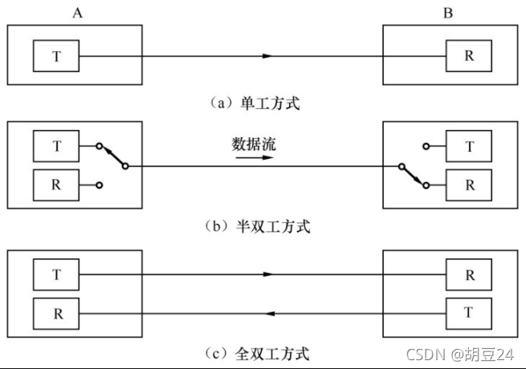
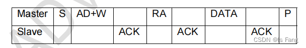
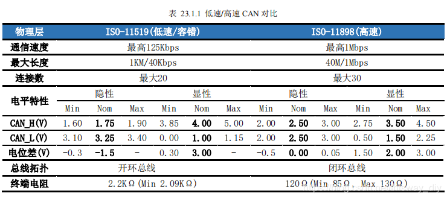

# 单片机入门
- 单片机属于是一种集成电路芯片，是把微型计算机中的**中央处理器（CPU）、存储器、输入接口、输出接口、定时计数器及中断系统**等基本功能部件集成在一块集成电路芯片上形成的微型计算机。
- 功能实现：编程（C语言/汇编语言）
- 编程目的：控制芯片各引脚在不同时期输出不同电平（高电平/低电平），进而控制与单片机各个引脚相连接的外围电路的电气状态

**单片机主要特点**

1、在存储器结构上，单片机的存储器采用**哈佛结构**。ROM和RAM是严格分开的。
- ROM是程序存储器，只存放程序、固定常数和数据表格。（flash）
- RAM是数据存储器，用作工作区及存放数据。
  
2、在芯片引脚上，大部分采用分时复用技术。
- 分时复用技术：不同时间段线路有不同的功能。
---
## 51单片机
[STC89Cxx中文参考手册](codeFile/STC89Cxx中文参考手册.pdf)
[C51单核A3&A4开发板原理图](codeFile/普中51-单核-A3&A4开发板原理图.pdf)
### 基本结构
- 8位CPU
- 片内ROM/程序存储器4K字节，寻址空间为64K
- 片内RAM/数据存储器64K字节，片外数据存储器寻址空间为64K
- 21字节的特殊功能寄存器
- 4个8位的并行I/O接口：P0~P3
- 2个16位定时/计数器
- 1个全双工串行I/O接口（UART）
- 5个中断源（2个优先级）
- 使用5V供电
### CPU
CPU含运算器、控制器、其他寄存器。
#### 运算器
算术/逻辑运算单元ALU、累加器ACC、寄存器B、暂存寄存器、程序状态字寄存器。
- 运算部件以**算术逻辑运算单元ALU**位核心，实现8位数据的**加减乘除算术运算**和**与或非等逻辑运算**，还有位处理功能。
- **累加器ACC**：一个8位的寄存器，用于向ALU提供操作数和存放运算的结果。使用频繁。
- **寄存器B**：辅助寄存器，它是为乘法和除法指令而设置的。
- **标志寄存器PSW**：用于保存ALU运算结果的状态。CY：高8位进位；AC：低4位进位。
  OV:溢出标志位，C与C6(次高位)的异或；P：奇偶标志位。

#### 控制器和其他寄存器
控制器由程序计数器PC，指令寄存器IR，指令译码器，数据指针寄存器以及定时控制与条件转移逻辑电路等组成。
- **程序计数器PC**:一个16位的计数器，作为程序存储器的地址指针，存放下一条指令的首地址。取出指令码的一个字节后，PC内容自动加 1。单片机**上电和复位**时，PC装入地址**0000H**，即上电或复位后，程序从0000H地址开始执行。
- **数据指针DPTR**：一个16位的寄存器，由2个8位的寄存器DPH和DPL组成，用来存放16位的地址。
### 存储器
程序存储器ROM和数据存储器RAM。
- ROM（程序存储器）存放程序、表格和始终要保留的常数，相当于计算机系统的硬盘；
- RAM（数据存储器）存放数据（常量或变量）或运算的结果，相当于计算机的内存；
#### ROM
8051单片机内部有4KB的程序存储器，可以再外接64KB程序存储器。
单片机可以利用/EA引脚确定运行片内或片外存储器的程序。
- 当单片机的/EA端接高电平（接电源正极）时，片内、片外程序存储器都可以使用，片内4KB 程序存储器的编址为0000H～0FFFH，片外64KB 程序存储器的编址为1000H～FFFFH，片外程序存储器在程序低于4KB存储空间无法使用。
- 当单片机的/EA端接低电平（接地）时，只能使用片外程序存储器，其编址为0000H～FFFFH，片内4KB程序存储器无法使用。

无论是使用片内ROM还是使用片外ROM，程序的起始地址都是从ROM的0000H单元开始的。
ROM空间一般可以根据用户需要任意安排使用，但ROM中的某些地址被中断程序的入口地址占用：
#### RAM
8051单片机内部有128字节的数据存储器，可以再外接64KB数据存储器。
8051单片机内部有128字节的数据存储器（地址为00H～7FH）和128字节的特殊功能寄存器区（地址为80H～FFH）。根据功能不同，8051单片机的数据存储器可分为工作寄存器区（0～3组）(32 Bytes)、位寻址区（16 Bytes）、用户RAM区（80 Bytes）、特殊功能寄存器区（128 bytes）。 
- **工作寄存器区**：总存储空间为32字节，由0～3组工作寄存器组成，每组有8个工作寄存器（R0～R7），共32个工作寄存器（存储单元），地址编号为00H～1FH，每个工作寄存器可存储一个字节数据（8位），暂时存放数据，可通过PSW设置寄存器组别。
- **位寻址区**：位于工作寄存器区之后，总存储空间为16字节，有16个字节存储单元，字节地址为20H～2FH，每个字节存储单元有8个存储位，一共有16×8=128个存储位，每个位都有地址，称为位地址，利用位地址可以直接对位进行读写。
- **用户RAM区**：用户RAM区又称为数据缓存区，8051单片机的用户RAM区有80个存储单元（字节），地址编号为30H～7FH，用户RAM区一般用来存储随机数据和运算中间结果等。
- **特殊功能寄存区SFR**：主要用于管理单片机内部各功能部件（如定时器/计数器、I/O 端口、中断控制器和串行通信口等），通过编程设定一些特殊功能寄存器的值，可以让相对应的功能部件进入设定的工作状态。
  堆栈指针寄存器（SP）:堆栈是指在单片机数据存储器中划分出的一个连续的存储空间，这个存储空间存取数据时具有“先进后出，后进先出”的特点。
  - 堆栈指针寄存器（SP）中的值并不是堆栈的第一个存储单元的地址，而是前一个单元的地址，例如SP=2FH，那么堆栈的第一个存储单元的地址是30H，第1个数据存入30H单元。**单片机通电复位后，SP的初始值为07H，这样堆栈第一个存储单元的地址就为08H**，由于08H～1FH地址已划分给1～3组工作寄存器，在需要用到堆栈时，通常在编程时设SP=2FH，这样就将堆栈设置在数据存储器的用户RAM区（30H～7FH）。
   


表中，凡是地址能被8整除的寄存器都是**可位寻址**的寄存器，否则为**字节寻址**的寄存器。
### I/O口
单片机的I/O端口是输入信号和输出信号的通道。8051单片机有P0、P1、P2、P3四组I/O 端口，每组端口有8个引脚。结构由易到难：P1-P3-P2-P0
#### P1端口
P1.n=1个锁存器+1个场效应管驱动器+2个三态门缓冲器

P1口的结构最简单，用途也单一，仅作为数据输入/输出端口使用。输出的信息有**锁存**，输入有**读引脚**和**读锁存器**之分。P1端口的结构见下图：

- 在读引脚前需先执行一条写1指令强迫场效应管驱动器截止。
- 读锁存器是为了获得前次的锁存值，读引脚是为了获得引脚的当前值。
#### P3端口
P3.n=1个锁存器+1个场效应管驱动器+2个三态门缓冲器+1个与非门

P3口是一个**多功能口**，它除了可以作为**I/O口**外，还具有**第二功能**，P3端口的结构见下图。

- 当处于第一功能时，第二输出功能线为1。
- 当处于第二功能时，锁存器输出1。
- 当处于第二输入功能时，锁存器置1，第二输出功能置1。

复用口P3对应功能：

#### P2端口
P2.n=1个锁存器+1个场效应管驱动器+2个三态门缓冲器+1个非门+两路开关

P2口的端口除了可用作**普通I/O**外，在外接存储器时，还可用作**地址总线（高8位）端口**。P2口结构见下图。

- 通用I/O口：控制线置0，两路开关置于锁存器端，这时有效电路与P1大体相同。
- 作为地址总线（高8位）使用时，控制线置1，两路开关置于地址线端。
#### P0端口
P0.n=1个锁存器+2个场效应管驱动器+2个三态门缓冲器+非门+与门+两路开关

P0口是一个多功能口，它除了可以作为**I/O口**外，还可以作为**地址/数据复用口**，在外接存储器时，还可用作**地址总线（低8位）端口**，P0端口的结构见下图。

- 通用I/O口：系统会将控制端置0，两路开关置于锁存器端。作为输出时，需要外接上拉电阻。作为输入时，CPU自动使地址/数据置1，控制端置0。无需自行控制，分时复用方式位无条件的真双向口。
- 作为地址/数据复用口：控制端置1，2个场效应管驱动器交替导通，无需外接上拉电阻。
- 作为外部地址总线（16位地址总线的低8位）

#### I/O总结
- P0~P3口都可以作为准双向通用I/O口，其中P0位需要外接上拉电阻，P0为真正的双向口。
- 扩展片外设备时，P2口可作为其地址线接口（高8位），P0口可作为其地址线/数据线复用接口（低8位）。
### 定时器/计数器
单片机的工作过程是**取一条指令、译码、进行微操作**如此循环。各指令的微操作在时间上有严格的次序，这种微操作的时间次序称为**时序**。
单片机能正常工作的必要条件之一就是时钟电路，时钟是单片机的脉搏，是单片机的驱动源，单片机工作是在统一的时钟脉冲控制下一拍一拍进行工作的。

单片机的时钟信号由**外部振荡**和**内部振荡**两种方式得到。


单片机的时钟振荡器可产生12MHz的时钟脉冲信号，经12分频后得到1MHz的脉冲信号，1MHz信号每个脉冲的持续时间为1μs。
计数器：每1μs，定时器加1，二进制加到16位一共可以从0数到65536(2^16)，超过65535产生中断；如果想要数10000个数，可以设置计数器的初值为55536，这样从初值55535数到65535就是10000个数。

- GATE位：门控位，用来控制定时器/计数器的启动模式。当GATE=0时，只要TCON寄存器的TRi位置“1”，就可启动Ti开始工作；当GATE=1时，除了需要将 TCON 寄存器的 TRi 位置“1”外，还要使/INTi引脚为高电平，才能启动Ti工作。
- C/T位：定时、计数功能设置位。当C/T=0时，将定时器/计数器设置为定时器工作模式；当C/T=1时，将定时器/计数器设置为计数器工作方式。
- M1、M0位：定时器/计数器工作方式设置位。M1、M0位取不同值，可以将定时器/计数器设置为不同的工作方式。TMOD寄存器高4位中的M1、M0用来控制T1的工作方式，低4位中的M1、M0用来控制T0的工作方式。


- TF0位和TF1位：分别为定时器/计数器0和定时器/计数器1的中断请求标志位。当定时器/计数器工作产生溢出时，会将TF0或TF1位置“1”，表示定时器/计数器T0或T1有中断请求。
- TR0和TR1：分别为定时器/计数器0和定时器/计数器1的启动/停止位。在编写程序时，若将TR0或TR1设为“1”，那么T0或T1定时器/计数器开始工作；若设置为“0”,T0或T1定时器/计数器则会停止工作。 


### 中断系统
中断就是计算机在执行某一程序的过程中，由计算机系统内部或外部的某种原因而必须终止当前程序的运行，先去执行相应的处理程序，然后再返回继续执行原程序。
C51中断系统主要组成部分：
- 五个中断源：分别为外部中断源INT0、INT1，定时器/计数器中断源T0、T1，和串行通信口中断源（TX和RX）。
- 中断源寄存器：定时器/计数器控制寄存器TCON和串行通信口控制寄存器SCON。
- 中断允许寄存器IE
- 中断优先级控制寄存器IP

**CPU会先响应优先级别高的中断源的请求：**

中断默认关闭，若要使用中断需要进行以下设置：
- 中断允许寄存器IE的`EA`位设为1，允许所有的中断(打开总开关)。
- 外部中断INTi：`EXi`置1，允许外部中断源的中断，中断请求由`IEi`控制,中断请求模式由`ITi`控制,**低电平触发(0)和下降沿触发(1)**。
- 定时器/计数器中断源Ti：`ETi`置1，允许定时器/计数器中断源的中断，中断请求由`TFi`控制。
- 串行通信口中断源RXD/TXD：`ES`置1，允许串行通信口中断源的中断，中断请求由`TI或RI`控制。

- IE0位和IE1位：分别为外部中断INT0/1的中断请求标志位。当外部有中断请求信号输入单片机的INT0引脚（即P3.2）或INT1引脚（即P3.3）时，TCON的IE0和IE1位会被置“1”。
- IT0位和IT1位：分别为外部中断0和外部中断1的输入方式控制位。当IT0=0时，外部中断 0 端输入低电平有效（即INT0端输入低电平时才表示输入了中断请求信号），当IT0=1时，外部中断0端输入下降沿有效。当IT1=0时，外部中断1端输入低电平有效，当IT1=1时，外部中断1端输入下降沿有效。 


- TI 位：串行通信口发送中断标志位。在串行通信时，每发送完一帧数据，串行通信口会将TI位置“1”，表明数据已发送完成，向CPU发送中断请求信号。
- RI 位：串行通信口接收中断标志位。在串行通信时，每接收完一帧数据，串行通信口会将RI位置“1”，表明数据已接收完成，向CPU发送中断请求信号。注意：单片机执行中断子程序后，TI 位和 RI位不能自动变为“0”，需要在退出中断子程序时，使用**软件清0**。


- EA位：总中断允许位。当EA=1时，总中断开关闭合；当EA=0时，总中断开关断开，所有的中断请求信号都不能接受。
- ES位：串行通信口中断允许位。当ES=1时，允许串行通信口的中断请求信号通过；当ES=0时，禁止串行通信口的中断请求信号通过。
- ETi位：定时器/计数器i中断允许位。当ETi=1时，允许定时器/计数器i的中断请求信号通过；当ETi=0时，禁止定时器/计数器i的中断请求信号通过。
- EXi位：外部中断i允许位。当EXi=1时，允许外部中断i的中断请求信号通过；当EXi=0时，禁止外部中断i的中断请求信号通过。


- PS位：串行通信口优先级设定位。当PS=1时，串行通信口为高优先级；当PS=0时，串行通信口为低优先级。
- PTi位：定时器/计数器i优先级设定位。当PTi=1时，定时器/计数器i为高优先级；当PTi=0时，定时器/计数器i为低优先级。
- PXi位：外部中断i优先级设定位。当PXi=1时，外部中断i为高优先级；当PXi=0时，外部中断i为低优先级。


- 外部中断和定时计数器中断由硬件自动清零
- 串口中断由软件清零

### 串行通信
根据**数据传输方式**的不同，可将通信分**并行通信**和**串行通信**两种。
- 并线通信：使用多线，适用于近距离传输，传输速度快。
- 串行通信：**按位依次传递数据**的通信方式，使用的线数少，适用于远距离传递，传输速度较慢。

根据传递方式的不同，串行通信可以分为单工、半双工、全双工。

串行通信又可分为**异步通信**和**同步通信**两种。
- 异步通信：在串行异步通信时，数据是以帧为单位传送的。一帧数据由**起始位、数据位、奇偶校验位和停止位**组成。
  起始位：表示一帧数据的开始，起始位一定为低电平。
  数据位：它是要传送的数据，紧跟在起始位后面。传送数据时是从低位到高位逐位进行的。
  奇偶校验位：该位用于检验传送的数据有无错误。
  停止位：它表示一帧数据的结束。停止位一定为高电平。
- 同步通信：同步通信的数据后面取消了停止位，前面的起始位用同步信号代替，在同步信号后面可以跟很多数据，所以同步通信传输速度快。

**串行通信口的结构：**
- 两个数据缓冲器SBUF：可以**直接寻址**的特殊功能寄存器（SFR），它包括发送SBUF和接收SBUF，发送SBUF用来发送串行数据，接收SBUF用来接收数据，**两者共用一个地址（99H）**。
- 输入移位寄存器：在接收控制器的控制下，将输入的数据逐位移入接收SBUF。
- 串行控制寄存器 SCON：控制串行通信口的工作方式，并反映串行通信口的工作状态。
- 定时器T1：T1用作波特率发生器，用来产生接收和发送数据所需的移位脉冲，移位脉冲的频率越高，接收和传送数据的速率越快。


**接收数据过程**：若RXD端接收到一帧数据的起始信号（低电平），SCON寄存器马上向接收控制器发出允许接收信号，接收控制器在定时器/计数器T1产生的移位脉冲信号控制下，控制输入移位寄存器，将 RXD 端输入的数据由低到高逐位移入输入移位寄存器中，数据全部移入输入移位寄存器后，移位寄存器再将全部数据送入接收 SBUF中，同时接收控制器通过或门向CPU发出中断请求，CPU马上响应中断，将接收SBUF中的数据全部取走，从而完成了一帧数据的接收。
**发送数据过程**：当CPU要发送数据时，只要将数据直接写入发送SBUF中，就启动了发送过程。在发送控制器的控制下，发送门打开，先发送一位起始信号（低电平），然后依次由低到高逐位发送数据，数据发送完毕，最后发送一位停止位（高电平），从而结束一帧数据的发送。一帧数据发送完成后，发送控制器通过或门向CPU发出中断请求，CPU响应中断，将下一帧数据送入SBUF，开始发送下一帧数据。
- SM0、SM1位：串行通信口工作方式设置位。
- SM2位：用来设置主-从式多机通信。
- REN位：允许/禁止数据接收的控制位。
- TB8位：方式2、3中发送数据的第9位（奇偶校验位/地址帧或数据帧的标志位）。
- RB8位：方式2、3中接收数据的第9位（奇偶校验位/地址帧或数据帧的标志位）。
- Ti/Ri位：发送中断标志位。


- SMOD位：波特率设置位。若SMOD=0，波特率不变；当SMOD=1时，波特率加倍。


### 复位电路
复位电路可以将电路恢复到起始状态。
51单片机复位方式有四种：外部RST引脚复位，软件复位，上电复位，看门狗复位。
- 外部RST引脚复位:外部向RST引脚拉高并维持一定时间后，单片机会进入复位状态，将RST复位引脚拉回低电平后，单片机结束复位状态并从用户程序区的0000H处开始正常工作。
- 软件复位：通过控制ISP_CONTR特殊功能寄存器，进行复位操作。
  
- 上电复位：上电后电容充电，RST置于高电平，进行复位操作。
- 看门狗复位：STC系列单片机内部自带了看门狗，看门狗有一个15位的计数器，在缺省状态下，看门狗计数器不计数，看门狗功能禁止。如果使能了看门狗功能，则计数器由0开始计数，计数到最大值32767时，则单片机便产生复位。因此程序要定时对看门狗计数器进行清零，以避免计数器溢出而引起系统复位，这称之为“喂狗”。如果程序跑飞陷入死循环，则无法喂狗，看门狗就可以迫使单片机复位。
  
  EN_WDT：看门狗允许位，当这一位设置为1时，使能看门狗。
  CLR_WDT：看门狗清0位，当这一位设置为1时，将看门狗的计数器清0。
  IDLE_WDT：看门狗空闲模式位，当这一位置1时，看门狗计数器在空闲模式下计数，当这一位清0时，看门狗计数器在空闲模式下不计数。
  PS2-PS0：看门狗计数器预分频系数。这三位用来设置看门狗计数器的计数周期。当采用12MHz的晶振，并采用12时钟模式时，PS2~PS0对预分频值和看门狗的溢出时间的设置如下表所示。
  


### C语言与C51
C51语言基本语法与标准C相同，是在标准C的基础上进行适合8051内核单片机硬件的扩展。

#### 程序结构
- 主函数
  ``` c
  void main(){
    while()
    {

    }
  }
  ```
- 中断函数
- 一般函数
#### C51特有的数据类型
主要不同在于C51中有专门针对51单片机的**特殊功能寄存器（SFR）型**和**位类型**。
|基本数据类型|长度|取值范围
|---|---|---|
|sfr|1字节|0~255
|sfr16|2字节|0~65535
|sbit|1位|0或1
|bit|1位|0或1
- sfr 名称=特殊功能寄存器**地址**;
- sfr16 名称=16位的特殊功能寄存器**地址**;
- sbit 名称=特殊功能寄存器**位地址**;
- sbit 名称=特殊功能寄存器**地址^位号**;//要使用需先定义sfr
- bit 位变量名[=初值];
#### C51变量的特殊属性
C51变量所处的单片机的存储器区域，由其变量定义中特殊的**存储器类型**决定。
|存储器类型|描述
|---|---|
|data|直接寻址的片内RAM低128b，访问速度最快
|bdata|片内RAM的可位寻址区（20H~2FH）,允许字节和位混合访问
|idata|间接寻址访问的片内RAM，允许访问全部片内RAM
|pdata|用Ri间接访问的片外RAM的低256b
|xdata|用DPTR间接访问的片外RAM，允许访问全部64kb片外RAM
|code|程序存储器ROM64kb空间
若用户不对变量的存储类型进行定义，C51的编译器采用默认的存储类型。默认的存储类型由编译命令中的存储模式指令限制。C51支持的存储模式如下表：
|存储模式|默认存储类型
|---|---|
|small|data
|compact|pdata
|large|xdata
#### C51特殊函数——中断函数
`函数类型 函数名(形式参数表) interrupt 中断号 using 寄存器组号`
``` c
void IRQHandler() interrupt 1{

}
``` 
- 中断函数不能使用参数传递。
- 中断函数没有返回值。
- 中断函数只能由系统自动调用。不能通过他函数进行调用。
- 中断函数中禁止使用extern存储类型（全局）。

## STM32
[stm32f103xx中文参考手册](codeFile/STM32F103x8B_DS_CH_V10.pdf)

STM32是一款单片机，它由意法半导体(ST)公司制造。ST是意法半导体的简称，M是指微控制器（也就是单片机的）MCU的第一个英文字母，32是指32位的CPU，它的CPU是采用的ARM公司的Cortex-M系列的内核设计。
- STM32具有高性价比，内部外设丰富，高MIPS（指每秒能处理的指令，以兆为单位），广泛的群众基础等特点。
- STM32芯片内部可以粗略划分两部分：**内核+片上外设**。如果与电脑类比，内核与片上外设就如同电脑的CPU与主板、内存、显卡、硬盘的关系。
  


### 命名规则


### 系统结构

STM32主系统主要由四个驱动单元和四个被动单元构成。
四个驱动单元是：**内核DCode总线、系统总线、通用DMA1、通用DMA2**
四个被动单元是：**AHB到APB的桥：连接所有的APB设备、内部flash闪存、内部SRAM、FSMC**
- ICode指令总线：内核指令总线与闪存指令接口相连，以加载指令程序。
- DCode数据总线：DCode总线与闪存存储器的数据接口相连接，以加载数据常量或调试数据。
- System系统总线：系统总线连接到总线矩阵，用来挂载外设（AHB）或加载SRAM的数据。
- DMA总线：DMA的AHB主控接口与总线矩阵相连，可提供在外设和存储器之间或者存储器和存储器之间的高速数据传输。（无需CPU干预）
- AHB/APB桥：这两个桥在AHB和2个APB总线间提供同步连接，APB1操作速度限于36MHz，APB2操作速度全速（72MHz）。
- Cortex-M3内核：它是STM32F103的内核，也就是CPU。除掉这个部件，其他部件都是片上外设，注意是片上的，也就是那块我们肉眼所见的芯片里的外设。
- FLASH：来记载指令和常量。（掉电不丢失）
- SRAM：处理变量和堆栈记录，且变量更改方便快速。（掉电丢失）
- RCC：用于管理外设方阵的作息。(使用片上外设，都得先开RCC)
- SDIO：SDIO专门用来与SD卡沟通的接口。

### 具体参数
- 内核：ARM 32位的Cortex™-M3 CPU
- 存储器：64K字节的flash、20K字节的SRAM（只要保持通电，存储的数据可以恒常保持）
- GPIO:37个GPIO，分别为PA0-PA15、PB0-PB15、PC13-PC15、PD0-PD1
- 定时器：4个16bit定时计数器，2个看门狗定时器，1个24bit向下计数的滴答定时器systick
- 通信接口：2个I2C接口、3个USART接口、2个SPI接口、CAN接口
- 支持外设：定时器、ADC、SPI、I2C和USART
- 工作电压：2V~3.6V

### 开发方式
- 使用标准外设库开发（常用）
- 使用寄存器开发（类似51）
- HAL库开发（图形化开发）

### GPIO
STM32芯片最拥有GPIOA、GPIOB…GPIOG等7组端口，每组端口最多拥有Pin0、Pin1…Pin15共16个引脚。
- STM32F103C8T6只有PA、PB以及个别PC引脚而STM32F103ZET6拥有PA~PG的全部112个引脚。
- 所有的GPIO都有基本的输入输出功能，同时GPIO还可以作为其它的外设功能引脚。


保护二极管：为防止芯片被外部过高或过低的输入电压烧坏，STM32内置保护二极管当引脚输入电压高于VDD-FT（**FT**标识代表可以容忍**5V**电压，不同的引脚对电压的容忍值不同）时上方的二极管导通，当引脚电压低于Vss时，下方的二极管导通，这样就可以防止不正常的电压引入芯片导致芯片烧毁。
上拉、下拉电阻：控制引脚默认状态的电压，开启上拉的时候引脚默认电压为高电平，开启下拉的时候引脚默认电压为低电平。
**TTL施密特触发器**：基本原理是当输入电压高于正向阈值电压，输出为高；当输入电压低于负向阈值电压，输出为低。IO口信号经过触发器后，模拟信号转化为0和1的数字信号，也就是高低电平，并且是TTL电平协议。
**P-MOS管和N-MOS管**：信号由P-MOS管和N-MOS管，依据两个MOS管的工作方式，使得GPIO具有“推挽输出”和“开漏输出”的模式。P-MOS管高电平导通，低电平关闭，下方的N-MOS低电平导通，高电平关闭。

#### GPIO工作模式


**输入模式：**
- GPIO_Mode_IN_FLOATING 浮空输入：浮空输入模式下，I/O端口的电平信号直接进入输入数据寄存器。MCU直接读取I/O口电平，I/O的电平状态是不确定的，完全由外部输入决定。
- GPIO_Mode_IPU 上拉输入：IO内部接上拉电阻，此时如果IO口外部没有信号输入或者引脚悬空，IO口默认为高电平  如果I/O口输入低电平，那么引脚就为低电平。
- GPIO_Mode_IPD 下拉输入： IO内部接下拉电阻，此时如果IO口外部没有信号输入或者引脚悬空，IO口默认为低电平  如果I/O口输入高电平，那么引脚就为高电平。
- GPIO_Mode_AIN 模拟输入：当GPIO引脚用于ADC采集电压的输入通道时，用作"模拟输入"功能，此时信号不经过施密特触发器，直接直接进入ADC模块，并且输入数据寄存器为空 ，CPU不能在输入数据寄存器上读到引脚状态。
  
**输出模式：**
- GPIO_Mode_Out_OD 开漏输出：在开漏输出模式时，只有N-MOS管工作，如果我们控制输出为0，低电平，则P-MOS管关闭，N-MOS管导通，使输出低电平，I/O端口的电平就是低电平，若控制输出为1时，高电平，则P-MOS管和N-MOS管都关闭，输出指令就不会起到作用。（低电平有驱动能力，高电平没有驱动能力）
- GPIO_Mode_AF_OD 复用开漏输出：输出信号来源改变，其他与开漏输出功能相同。
- GPIO_Mode_Out_PP 推挽输出：在推挽输出模式时，N-MOS管和P-MOS管都工作，如果我们控制输出为0，低电平，则P-MOS管关闭，N-MOS管导通，使输出低电平，I/O端口的电平就是低电平，若控制输出为1 高电平，则P-MOS管导通N-MOS管关闭，使输出高电平，I/O端口的电平就是高电平。
- GPIO_Mode_AF_PP 复用推挽输出：除了输出信号的来源改变 其他与开漏输出功能相同。


推挽输出的最大特点是可以真正能真正的输出高电平和低电平，在两种电平下都具有驱动能力。

#### GPIO相关寄存器
STM32的每组GPIO都包含7个寄存器，分别是：
- GPIOx_CRL  端口配置低寄存器
- GPIOx_CRH  端口配置高寄存器
- GPIOx_IDR  端口输入寄存器
- GPIOx_ODR  端口输出寄存器
- GPIOx_BSRR 端口位设置/清除寄存器
- GPIOx_BRR  端口位清除寄存器
- GPIOx_LCKR 端口配置锁存寄存器

每个I/O端口位可以自由编程，然而I/O端口寄存器必须按32位字被访问(不允许半字或字节访问)。

#### GPIO库函数
初始化函数：
`void GPIO_Init(GPIO_TypeDef* GPIOx, GPIO_InitTypeDef* GPIO_InitStruct);`
2个读取输入电平函数：
`uint8_t GPIO_ReadInputDataBit(GPIO_TypeDef* GPIOx, uint16_t GPIO_Pin);`
`uint16_t  GPIO_ReadInputData(GPIO_TypeDef* GPIOx);`
2个读取输出电平函数：
`uint8_t  GPIO_ReadOutputDataBit(GPIO_TypeDef* GPIOx, uint16_t GPIO_Pin);`
`uint16_t  GPIO_ReadOutputData(GPIO_TypeDef* GPIOx);`
4个设置输出电平函数：
`void GPIO_SetBits(GPIO_TypeDef* GPIOx, uint16_t GPIO_Pin);`
`void GPIO_ResetBits(GPIO_TypeDef* GPIOx, uint16_t GPIO_Pin);`
`void GPIO_WriteBit(GPIO_TypeDef* GPIOx, uint16_t GPIO_Pin, BitAction BitVal);`
`void GPIO_Write(GPIO_TypeDef* GPIOx, uint16_t PortVal);`

### 外部中断
stm32的每个IO口都可以作为外部中断输入。
STM32的中断控制器支持19个外部中断/事件请求：
- 线0~15：对应外部IO口的输入中断。
- 线16：连接到PVD输出。
- 线17：连接到RTC闹钟事件。
- 线18：连接到USB唤醒事件。

每个外部中断线可以独立的配置触发方式（上升沿，下降沿或者双边沿触发），触发/屏蔽，专用的状态位。

#### 外部中断相关寄存器
- 中断屏蔽寄存器（EXTI_IMR）
- 事件屏蔽寄存器（EXTI_EMR）
- 上升沿触发选择寄存器（EXTI_RTSR）
- 下降沿触发选择寄存器（EXTI_FTSR）
- 软件中断事件寄存器（EXTI_SWIER）
- 挂起寄存器（EXTI_PR）

#### 中断服务函数的映射关系
|GPIO|	IRQn|	IRQHandler
|---|---|---|
|GPIO_Pin0|	EXTI0_IRQn|	EXTI0_IRQHandler
|GPIO_Pin1|	EXTI1_IRQn|	EXTI1_IRQHandler
|GPIO_Pin2|	EXTI2_IRQn|	EXTI2_IRQHandler
|GPIO_Pin3|	EXTI3_IRQn|	EXTI3_IRQHandler
|GPIO_Pin4|	EXTI4_IRQn|	EXTI4_IRQHandler
|GPIO_Pin5 — GPIO_Pin9|	EXTI9_5_IRQn|	EXTI9_5_IRQHandler
|GPIO_Pin10 — GPIO_Pin15|	EXTI15_10_IRQn|	EXTI15_10_IRQHandler

#### 外部中断库函数
- 设置IO口与中断线的映射关系：`void GPIO_EXTILineConfig(uint8_t GPIO_PortSource, uint8_t GPIO_PinSource);`
- 初始化中断线：`void EXTI_Init(EXTI_InitTypeDef* EXTI_InitStruct);`
- 判断中断线中断状态，是否发生:`ITStatus EXTI_GetITStatus(uint32_t EXTI_Line);`
- 清除中断线上的中断标志位:`void EXTI_ClearITPendingBit(uint32_t EXTI_Line);`

#### 注意事项
使用外部中断需要：
- 开启IO口复位时钟：`RCC_APB2PeriphClockCmd(RCC_APB2Periph_AFIO,ENABLE);`
- 编写中断服务函数：`EXTIx_IRQHandler();`
  
**中断服务函数还需要清除中断标志位。**

### NVIC中断优先级管理
- **抢占优先级**也就是先占优先级，概念等同于51单片机中的中断。假设有两中断先后触发，已经在执行的中断抢占优先级如果没有后触发的中断抢占优先级更高，就会先处理抢占优先级高的中断。也就是说又有较高的抢占优先级的中断可以打断抢占优先级较低的中断。这是实现中断嵌套的基础。
- **响应优先级**，也就是次占优先级，只在同一抢占优先级的中断同时触发时起作用，抢占优先级相同，则优先执行响应优先级较高的中断。响应优先级不会造成中断嵌套。 如果中断的两个优先级都一致，则优先执行位于中断向量表中位置较高的中断。

#### 中断优先级分组


#### NVIC库函数
- NVIC初始化函数：`void NVIC_Init(NVIC_InitTypeDef* NVIC_InitStruct);`
- 设置中断优先级分组：`void NVIC_PriorityGroupConfig(uint32_t NVIC_PriorityGroup);`

**整个系统执行过程中，只设置一次中断分组。**

### 定时器
通俗来讲是一个用来定时的机器，是存在与stm32单片机中的一个外设。
stm32共有**8**个定时器，分别为：
- 2个高级定时器（TIM1、TIM8）：一个 16 位的可以向上/下计数的定时器，可以定时，可以输出比较，可以输入捕捉，还可以有三相电机互补输出信号，每个定时器有 8 个外部 IO。
- 4个通用定时器（TIM2、TIM3、TIM4、TIM5）：一个 16 位的可以向上/下计数的定时器，可以定时，可以输出比较，可以输入捕获，每个定时器有四个外部 IO。
- 2个基本定时器（TIM5、TIM6）：一个 16 位的只能向上计数的定时器，只能定时，没有外部IO。

#### 通用定时器框图

框图分为四个大部分：1、时钟源产生；2、时基单元电路；3、输入捕获；4、输出比较。

时钟源的产生：
- 内部时钟(CK_INT)
- 外部时钟模式2：外部触发输入(ETR)
- 内部触发输入(ITRx)：使用一个定时器作为另一个定时器的预分频器，如可以配置一个定时器Timer1而作为另一个定时器Timer2的预分频器。
- 外部时钟模式1：外部输入脚(TIx)

#### 定时器主要功能
- 定时中断
- 计数器
- 输出比较
- 输入捕获

#### 定时中断库函数配置

- TIM时钟使能：`void RCC_APB1PeriphClockCmd(uint32_t RCC_APB1Periph, FunctionalState NewState);`
- 选择内部时钟源：`void TIM_InternalClockConfig(TIM_TypeDef* TIMx);`
- 初始化定时器参数:`void TIM_TimeBaseInit(TIM_TypeDef* TIMx, TIM_TimeBaseInitTypeDef* TIM_TimeBaseInitStruct);`
- 清除更新中断标志位：`void TIM_ClearFlag(TIM_TypeDef* TIMx, uint16_t TIM_FLAG);`
- 允许更新中断:`void TIM_ITConfig(TIM_TypeDef* TIMx, uint16_t TIM_IT, FunctionalState NewState);`
- 中断优先级设置
- 使能TIM：`void TIM_Cmd(TIM_TypeDef* TIMx, FunctionalState NewState);`
- 编写中断服务函数：`void TIMx_IRQHandler(void)`

定时器计算公式：CK_CNT_OV=CK_PSC/(PSC + 1)/(ARR + 1) 
CK_PSC = 72MHz
定时1s，定时频率为1Hz

#### 计数器库函数配置
- 配置外部时钟引脚:`GPIO_Init();`
- 开启外部时钟模式2：`void TIM_ETRClockMode2Config(TIM_TypeDef* TIMx, uint16_t TIM_ExtTRGPrescaler, uint16_t TIM_ExtTRGPolarity, uint16_t ExtTRGFilter);`
- 设置PSC定时器分频为0
- 定时中断配置。

#### OC输出比较/输出PWM波形
输出比较可以通过比较CNT与CCR寄存器值的关系，来对输出电平进行置1、置0或翻转的操作，用于输出一定频率和占空比的PWM波形。
**PWM脉冲宽度调制**：在具有惯性的系统中，可以通过对一系列脉冲的宽度进行调制，来等效地获得所需要的模拟参量，常应用于电机控速、呼吸灯等领域。

- PWM频率：Freq = CK_PSC / (PSC + 1) / (ARR + 1)
- PWM占空比：Duty = CCR / (ARR + 1)
- PWM分辨率：Reso = 1 / (ARR + 1)

##### PWM库函数配置
- 配置GPIO
- 开启内部时钟
- 初始化定时器
- 输出比较通道配置：`void TIM_OCxInit(TIM_TypeDef* TIMx, TIM_OCInitTypeDef* TIM_OCInitStruct);`
- 输出比较通道配置初始值：`TIM_OCStructInit(&TIM_OCInitStructure);`

#### IC输入捕获
输入捕获模式下，当通道输入引脚出现指定电平跳变时，当前CNT的值将被锁存到CCR中，可用于测量PWM波形的频率、占空比、脉冲间隔、电平持续时间等参数。
- 可配置为PWMI模式，同时测量频率和占空比
- 可配合主从触发模式，实现硬件全自动测量

测周法：两个上升沿内，以标准频率fc计次，得到N ，则频率`f_x=f_c / N`


- 上升沿发生后，CCR1=CNT，CNT清零，CNT持续自增到下一次上升沿。
- CCR1的值为N


- 上升沿发生后，CCR1=CNT，CNT清零，CNT持续自增，下降沿发生后，CCR2=CNT，CNT继续自增到下一个上升沿
- 占空比：CCR2 / CCR1

##### IC库函数配置
- 配置GPIO
- 开启定时器
- 初始化定时器
- 输入捕获通道配置：`void TIM_ICInit(TIM_TypeDef* TIMx, TIM_ICInitTypeDef* TIM_ICInitStruct);`
- PWMI模式：`void TIM_PWMIConfig(TIM_TypeDef* TIMx, TIM_ICInitTypeDef* TIM_ICInitStruct);`
- 触发源选择：`void TIM_SelectInputTrigger(TIM_TypeDef* TIMx, uint16_t TIM_InputTriggerSource);`
- 主从模式配置：`void TIM_SelectSlaveMode(TIM_TypeDef* TIMx, uint16_t TIM_SlaveMode);`

### ADC模拟/数字转换器
ADC可以将引脚上连续变化的模拟电压转换为内存中存储的数字变量，建立模拟电路到数字电路的桥梁。
- 12位逐次逼近型ADC
- 输入电压范围：0-3.3V，转换结果范围：0-4095
- ADC输入时钟ADCCLK不超过**14MHz**，由PCLK2经分频产生。
- 转换模式：支持**单次转换**和**连续转换**
- 通道描述：**规则组**和**注入组**（相当于中断）
- ADC由一个内置自校准模式。

#### ADC库函数配置
- 开启ADC时钟：`void RCC_APB2PeriphClockCmd(uint32_t RCC_APB2Periph, FunctionalState NewState);`
- 配置ADC时钟分频：`void RCC_ADCCLKConfig(uint32_t RCC_PCLK2);`
- 配置转换通道：`void ADC_RegularChannelConfig(ADC_TypeDef* ADCx, uint8_t ADC_Channel, uint8_t Rank, uint8_t ADC_SampleTime);`
- 初始化ADC：`void ADC_Init(ADC_TypeDef* ADCx, ADC_InitTypeDef* ADC_InitStruct);`
- 使能ADC：`void ADC_Cmd(ADC_TypeDef* ADCx, FunctionalState NewState)`
- ADC校准函数：
  初始化ADC校准寄存器：`void ADC_ResetCalibration(ADC_TypeDef* ADCx);`
	等待校准寄存器初始化完成：`while (ADC_GetResetCalibrationStatus(ADC_TypeDef* ADCx) == SET);`
	ADC开始校准：`void ADC_StartCalibration(ADC_TypeDef* ADCx);`
	等待校准完成：`while (ADC_GetResetCalibrationStatus(ADC_TypeDef* ADCx) == SET);`
- 软件触发：`void ADC_SoftwareStartConvCmd(ADC_TypeDef* ADCx, FunctionalState NewState);`

### DMA直接存储器存取
DMA可以提供**外设和存储器**或者**存储器和存储器**之间的高速数据传输，无须CPU干预，节省了CPU的资源。
- 12个独立可配置的通道： DMA1（7个通道）， DMA2（5个通道）
- 每个通道都支持**软件触发**和特定的**硬件触发**


传输参数：涉及源地址、目标地址、传输数据量、传输次数。

#### DMA库函数配置
- 使能DMA时钟：`void RCC_AHBPeriphClockCmd(uint32_t RCC_AHBPeriph, FunctionalState NewState)`
- 初始化DMA通道：`void DMA_Init(DMA_Channel_TypeDef* DMAy_Channelx, DMA_InitTypeDef* DMA_InitStruct)`
- 使能外设DMA：`void DMA_Cmd(DMA_Channel_TypeDef* DMAy_Channelx, FunctionalState NewState)`
- 查询DMA传输状态：`FlagStatus DMA_GetFlagStatus(uint32_t DMAy_FLAG)`
- 打开ADC和DMA链接通道：`void ADC_DMACmd(ADC_TypeDef* ADCx, FunctionalState NewState)`

### 通信协议
按照数据传送方向分为：单工、半双工、全双工

通信协议分类：

TTL电平：+3.3V或+5V表示1，0V表示0

#### USART通用同步/异步收发器
全双工异步通信，发送和接收共用的可编程波特率，最高可达4.5Mbits/s。
- 波特率：串口通信速率
- 起始位：标志一个数据帧的开始，固定为低电平（空闲状态为高电平）
- 数据位：要发送或接收的信息，位数一般有8位或9位，**低位先行**
- 校验位：奇偶校验，数据位末尾选择是否添加奇偶校验位，用于检测数据传输是否正确。
- 停止位：信息传输结束的标志位，位长度（0.5/1/1.5/2），固定为高电平


STM32的串口通信是由波特率发生器产生波特率，给来自PCLK1/2的时钟做预分频，再经过1/16分频后传给发送/接收控制器，最后分别发送给发送移位寄存器和接收移位寄存器。这两个寄存器分别在发送数据寄存器（TDR）和接收数据寄存器（RDR）的控制下完成和外部之间的数据发送和接收。
(发送：发送数据寄存器->发送移位寄存器->GPIO)
(接收：GPIO->接收移位寄存器->接收数据寄存器)

##### USART库函数配置
- 时钟使能、GPIO初始化
- 初始化串口：`void USART_Init(USART_TypeDef* USARTx, USART_I nitTypeDef* USART_InitStruct)`
- 允许串口中断：`void USART_ITConfig(USART_TypeDef* USARTx, uint16_t USART_IT, FunctionalState NewState)`
- 使能串口：`void USART_Cmd(USART_TypeDef* USARTx, FunctionalState NewState)`
- 中断处理函数：`USARTx_IRQHandler();`
- 串口数据收发：
  `void USART_SendData(USART_TypeDef* USARTx, uint16_t Data)`
  `uint16_t USART_ReceiveData(USART_TypeDef* USARTx)`
- 串口传输状态获取：`FlagStatus USART_GetFlagStatus(USART_TypeDef* USARTx, uint16_t USART_FLAG); `
- 判断是否发生中断：`ITStatus USART_GetITStatus(USART_TypeDef* USARTx, uint16_t USART_IT)`
- 清除中断标志位：`void USART_ClearITPendingBit(USART_TypeDef* USARTx, uint16_t USART_IT)`

#### I2C集成电路总线
同步半双工串行通信总线，有两条通讯线SCL和SDA，没有严格的波特率要求。
- 带有数据应答
- 支持7位/10位地址模式
- 支持总线挂载多设备（一主多从、多主多从），每个设备有独立的地址
- 传输速度：标准100kbit/s、快速400kbit/s、高速3.4Mbit/s（大多不支持）
- 可软件模拟I2C通信，通过软件手动翻转电平实现

##### I2C通信硬件电路

- 所有I2C设备的SCL连在一起，SDA连在一起
- 设备的SCL与SDA均设置为开漏输出模式（只有低电平和浮空两种状态）
- SCL和SDA总线各添加一个上拉电阻，阻值一般为4.7k
- 为防止总线电源短路，I2C禁止所有设备输出强上拉高电平（不能为推挽模式），采用外置弱上拉电阻+开漏输出的电路结构，可以同时兼具输入和输出功能
- 当一个I2C设备空闲时，其输出高阻态，相当于断路，整个I2C总线只有开启了的设备才会进行正常的通信，不会干扰到其他设备。
- 当所有设备都空闲，都输出高阻态，此时上拉电阻将总线拉到高电平（变化相对较慢）。

##### I2C时序基本单元
起始或终止：SCL高电平时，SDA变化
读写：SCL低电平时，SDA变化；SCL高电平时，SCL不变
- 起始条件：SCL高电平期间，SDA从高电平切换到低电平
- 终止条件：SCL高电平期间，SDA从低电平切换到高电平
- 发送一个字节：SCL低电平期间，主机将数据位依次放到SDA线上（高位先行），然后释放SCL，从机将在SCL高电平期间读取数据位，所以SCL高电平期间SDA不允许有数据变化，依次循环上述过程8次，即可发送一个字节
- 接收一个字节：SCL低电平期间，从机将数据位依次放到SDA线上（高位先行），然后释放SCL，主机将在SCL高电平期间读取数据位，所以SCL高电平期间SDA不允许有数据变化，依次循环上述过程8次，即可接收一个字节（主机在接收之前，需要释放SDA）此时从机获得SDA控制权，**释放SDA就是主机切换成输入模式，“释放”可以理解为主机原本就是输入模式，在下拉为低电平时是输出模式**
- 发送应答：主机在接收完一个字节之后，在下一个时钟发送一位数据，数据0表示应答，数据1表示非应答
- 接收应答：主机在发送完一个字节之后，在下一个时钟接收一位数据，判断从机是否应答，数据0表示应答，数据1表示非应答（主机在接收之前，需要释放SDA）

串口通信发送与接收是低位先行，I2C是高位先行
由于有时钟线的控制，主机可以进入中断，此时传输会暂停，时序不会发送变化

##### I2C时序
从机设备地址分为7位和10位，一般相同型号的芯片地址是一样的，可通过硬件方法改变设备地址

**指定地址写：** 对于指定设备（Slave Address），在指定地址（Reg Address）下，写入指定数据（Data）


- 起始后，第一个字节内容必须为从机地址+读写位（0写1读）
- 接收应答：由于主机释放SDA之后立即就被从机拉低表示接收到该字节，根据线与的特性，此处就没有拉高的波形出现
- 在写操作时，第二个字节可以是指令控制字（如AD转换器）或寄存器地址（如MPU6050）
- 第三个字节才是真正写入的数据Data




**指定地址读：** 对于指定设备（Slave Address），在指定地址（Reg Address）下，读取从机数据（Data）


- 指定地址读 = 指定地址写 + 当前地址读（第三个字节不写入内容直接开始读）
- sr表示重复起始条件


##### I2C外设基本结构


##### 软件I2C和硬件I2C
- 软件I2C：软件I2C通信指的是用单片机的两个I/O端口模拟出来的I2C，用软件控制管脚状态以模拟I2C通信波形，软件模拟寄存器的工作方式。
- 硬件I2C：一块硬件电路，硬件I2C对应芯片上的外设，有相应的I2C驱动电路，其所使用的I2C管脚也是专用的，硬件I2C直接调用内部寄存器进行配置。
  
硬件I2C的效率要远高于软件的，而软件I2C由于不受管脚限制，接口比较灵活。

##### I2C库函数配置
- 时钟使能，GPIO初始化。
- 初始化I2C：`void I2C_Init(I2C_TypeDef* I2Cx, I2C_InitTypeDef* I2C_InitStruct)`
- 使能I2C：`void I2C_Cmd(I2C_TypeDef* I2Cx, FunctionalState NewState)`
- 起始条件：`void I2C_GenerateSTART(I2C_TypeDef* I2Cx, FunctionalState NewState)`
- 终止条件：`void I2C_GenerateSTOP(I2C_TypeDef* I2Cx, FunctionalState NewState)`
- 发送7位地址+读写位：`void I2C_Send7bitAddress(I2C_TypeDef* I2Cx, uint8_t Address, uint8_t I2C_Direction)`
- 发送数据：`void I2C_SendData(I2C_TypeDef* I2Cx, uint8_t Data)`
- 接收数据：`uint8_t I2C_ReceiveData(I2C_TypeDef* I2Cx)`
- 应答使能：`void I2C_AcknowledgeConfig(I2C_TypeDef* I2Cx, FunctionalState NewState)`
- 检查I2C事件：`ErrorStatus I2C_CheckEvent(I2C_TypeDef* I2Cx, uint32_t I2C_EVENT)`

#### SPI串行外设接口
- 高速、全双工、同步通信
- SPI收发数据是通过字节交换来实现的
- 通过交换字节实现发送一个字节，接收一个字节，发送同时接收一个字节的三种功能

##### SPI通信硬件电路

所有SPI设备的SCK、MOSI、MISO分别连在一起，主机另外引出多条SS控制线，分别接到各从机的SS引脚。
- SS片选设备线：主机选择对应的从机进行传输数据，SPI中规定通信以SS信号线拉低为开始，拉高为结束（看手册，不同模块不同）。
- SCK时钟信号线：同步通信，需要一根信号线统一主机和从机之间的数据传输，不同设备支持的最高传输频率可能不一样，**在传输过程中传输频率受限于低速的一方**。
- MOSI：主机向从机传输数据。
- MISO：主机接收从机的数据。

**输出引脚配置为推挽输出，输入引脚配置为浮空或上拉输入。**


##### SPI协议时序
SPI协议时序也被称为工作模式，SPI一共有四种工作模式，通过**时钟极性CPOL**和**时钟相位CPHA**进行确定。

起始条件：SS从高电平切换到低电平
终止条件：SS从低电平切换到高电平
交换一个字节（模式0）：
- CPOL=0：空闲状态时，SCK为低电平
- CPHA=0：SCK奇数跳变沿主从机移入（采样）数据，偶数跳变沿主从机移出（输出）数据


未被主机选中的从机，也就是从机空闲时，处于高阻态，相当于浮空状态。

#### CAN 控制器局域网
其特点是可拓展性好，可承受大量数据的高速通信，高度稳定可靠，因此常应用于汽车电子领域、工业自动化、医疗设备等高要求环境。

##### CAN的两个ISO国际标准
ISO11519(低速CAN)：定义了通信速率为10～125Kbps的低速CAN通信标准，属于开环总线，传输速率为40Kbps时，总线长度可达1000米；

- 低速CAN主要应用在车身控制系统等**可靠性要求高**的场景，低速CAN在断掉其任一导线后，仍可以继续接收数据，因此在汽车发生交通事故时，使用低速CAN能更大提高设备正常接收数据工作的可能性，提高安全性。
- 基于ISO11519标准的低速CAN，是一个“开环网络”，每根总线上个串联一个2.2KΩ的电阻。
  

ISO11898(高速CAN)：定义了通信速率为125Kbps～1 Mbps的高速CAN通信标准，属于闭环总线，传输速率可达1Mbps，总线长度≤40米；
- 高速CAN主要应用在发动机、变速箱等对**实时性、传输速度要求高**的场景。
- 基于ISO11898标准的高速CAN，是一个“闭环网络”，总线的两端各需串联一个120Ω的电阻用于阻抗匹配，以减少回波反射。


###### CAN差分信号
CAN使用差分信号传输数据。CAN总线使用CAN_H和CAN_L的电位差来表示数据电平。电位差分为显性电平和隐性电平，分别表示逻辑0和1。
- 显性电平0：CAN_H和CAN_L电压相差大
- 阴性电平1：CAN_H和CAN_L电压相近




##### CAN通信协议
CAN通讯协议并没有时钟信号线，所以各个节点之间要约定好特定的**波特率**进行通讯，特别的时候我们还需要使用**位同步**！
###### 位时序
所谓位时序，就是一个数据位的时序。我们可以把一个数据位分为四段。


SS段：又叫做同步段，它的作用就是判断节点与总线的时序是否一致，它的长度为1tq，tq就相当于一个时间单位，我们可以规定它的大小，**一般tq=1us**。
PTS段：传播时间段，用于补偿网络的延时时间。
PBS1,PBS2：都是用来补偿阶段的误差。

###### 位同步
当数据开始传输的时候会有一个帧起始信号，这个帧起始信号会产生一个下降沿（由高变低），正常情况下这个下降沿是在SS段的，如果不在则需要进行位同步。位同步分为**硬同步和重新同步**


###### 帧种类
CAN总线以“帧”（Frame）的形式进行通信。CAN 总线协议规定了5种帧，分别是数据帧、远程帧、错误帧、超载帧以及帧间隔，其中数据帧最常用。

###### 数据帧
数据帧由七段组成,分为标准帧（CAN2.0A）和扩展帧（CAN2.0B），主要体现在在仲裁段和控制段上。

- 帧起始：1bit，显性信号，表示数据帧的开始
- 仲裁段：包括标识符位(ID)和远程发送请求位(RTR)
  - 标准帧的ID位是11位，即范围是0x000~0x7FF
  - 扩展帧的ID是11+18=29位
  - ID决定报文的优先级高低，也决定这拓扑结构的节点是否接收此ID的帧数据
  - 远程发送请求位区分数据帧和远程帧，显性信号0代表数据帧，隐性信号1代表远程帧
- 控制段：标准帧中由扩展标识符位（IDE，1 bit）、保留位0（R0，1 bit）、数据长度编码位（DLC，4 bits）组成；扩展帧用由两个保留位（Reseved bit，2 bit）、数据长度编码位（DLC，4 bits）组成;
- 数据段：发送数据的内容，最多8个字节（64 bits），它的实际长度会写到前面的数据长度编码位DLC里
- 循环校验段：包括循环校验序列CRC和界定符DEL；循环校验序列用于校验传输是否正确；界定符用于表示循环校验序列是否结束；
- 确认段：包括应答位ACK和界定符DEL；确认位在节点收到正确的CRC序列时，发送端的ACK位被置位；界定符表示确认是否正常接收；
- 帧结束：7 bits，隐性信号，表示帧的结束。

标准数据帧最大为108 bit

##### CAN网络
CAN网络可以理解为多台CAN设备连接在同一条CAN总线上组合成的网络，其中的CAN设备我们称之为节点。CAN网络拓扑结构如下图：

一个CAN节点主要包含三类：**MCU应用程序、CAN控制器、CAN收发器**。
- 一般现在CAN控制器都是与处理器集成在一起。
- CAN收发器：将CAN收发引脚（CAN_TX和CAN_RX）的TTL信号转换成CAN总线的差分信号。


