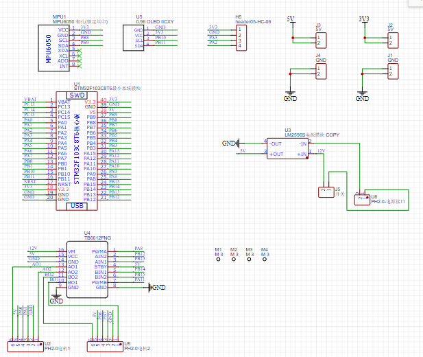
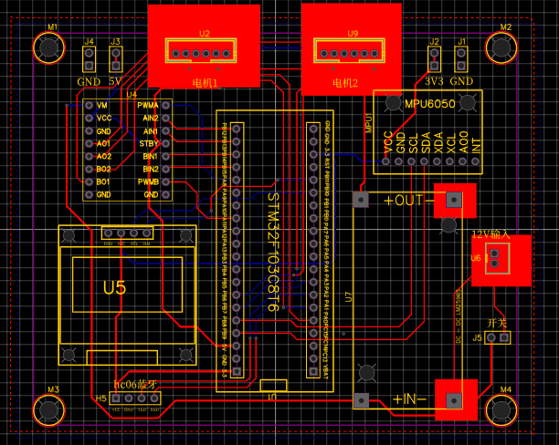
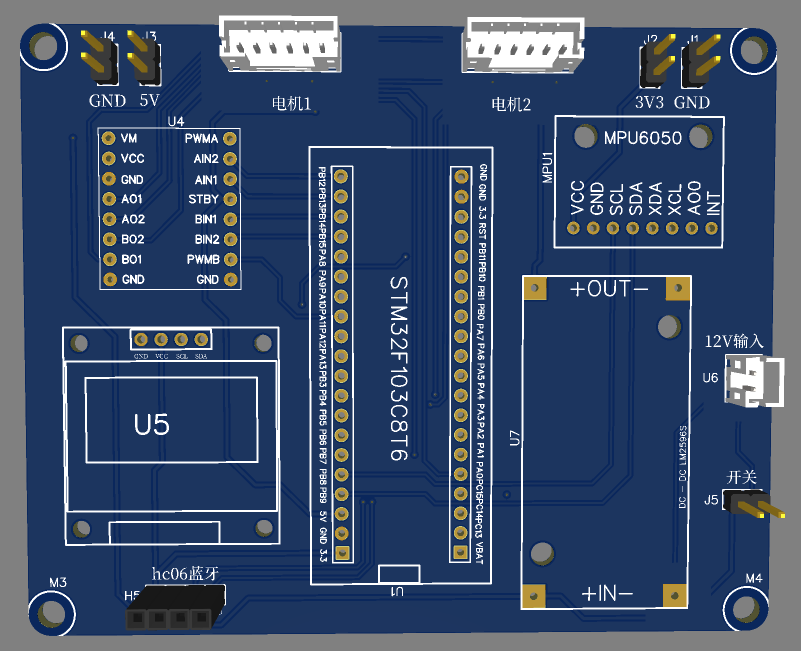
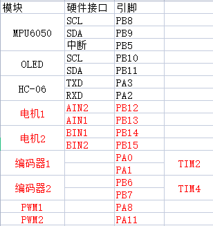
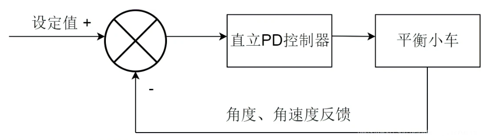
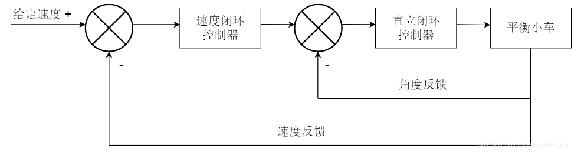

# 平衡小车
## 硬件准备
- 主控板：STM32f103c8t6
- 电机：25GA370直流减速电机
- 驱动：TB6612FNG
- DC-DC模块：LM2596S 12V转5V
- 陀螺仪：MPU6050
- OLED:128*64、0.96寸、IIC通信
- 其他：充电电池*3、电池座、PH2.0mm连接线、铜柱螺丝
- 后续拓展：蓝牙hc06

### 底板pcb

#### 原理图


#### PCB



### 引脚接线


## 程序编写

### Encoder电机编码器
通过定时器计算电机转动速度

- GPIO初始化
- 定时器初始化
- 设置编码器模式
- 输入捕获初始化
- 速度读取函数()：定时读取计数值并清0计数

### MOTOR电机驱动函数
使能电机，调用PWM函数控制电机前进与后退的速度

- GPIO初始化
- 赋值函数()：通过入口参数正负使能电机正反转，调用PWM函数控制速度
- 限幅函数()：确定正反转最大转速

### PWM函数
输出PWM波形，控制电机转速

- GPIO初始化
- 定时器初始化
- 输出比较初始化

### MPU6050
读取陀螺仪数据，引用库函数

### OLED
显示数据，引用库函数

### 定时器中断函数
按照一定频率，进入中断采样陀螺仪数据，并完成直立环、速度环、转向环的电机控制操作

- 定时器初始化，设置采样频率为`72MHZ / 7200 / 50 = 200HZ`

## pid算法在平衡小车上的应用

PID总共有三个字符，分别是p,i,d,分别代表比例，积分，微分三种不同的计算方式。

- p可以更快的让控制的点到达所要到达值附近
- d可以快速的来让到达目标值附近的变量快速冷静下来，稳定在目标值附近
- i可以解决偏离目标值过远的情况的局部最优解情况

pid算法也就是说要对于`某一变量到达目标值`所做的操作函数。

### 直立环
小车往哪边倒，车轮往哪边开



算法公式：
$
a=b1×θ+b2×θ’
$

直立环输出=Kp1×角度偏差+Kd×角度偏差的微分（角速度）
角度偏差=真实角度-期望角度

```
/*****************  
直立环PD控制器
输入参数：Med:机械中值(期望角度)，Angle:真实角度，gyro_Y:真实角速度
输出：直立环输出
******************/
int Vertical(float Med,float Angle,float gyro_Y) 
{
    int PWM_out;

    PWM_out = Vertical_Kp*(Angle-Med)+Vertical_Kd*(gyro_Y-0);

    return PWM_out;
} 
```

### 速度环
通过速度反馈使得小车保持平衡



算法公式：
$
a=b1×V+b2×ΣV
$

速度环输出=Kp2×编码器偏差+Ki×编码器偏差的积分
编码器偏差=反馈编码器值-期望编码器值
- 速度环输出=直立环的期望角度

```
/*****************  
速度环PI控制器
输入参数：encoder_left：左编码器数值，encoder_right：右编码器数值
输出：速度环输出（直立环的期望角度）
******************/
int Velocity(int encoder_left,int encoder_right)
{
    static int PWM_out,Encoder_Err,Encoder_S,EnC_Err_Lowout,EnC_Err_Lowout_last;
    float a=0.7;

    //1.计算速度偏差
    Encoder_Err=(encoder_left+encoder_right)-0;//舍去误差
    //2.对速度偏差进行低通滤波
    //low_out=(1-a)*Ek+a*low_out_last;
    EnC_Err_Lowout=(1-a)*Encoder_Err+a*EnC_Err_Lowout_last;//使得波形更加平滑，滤除高频干扰，防止速度突变。
    EnC_Err_Lowout_last=EnC_Err_Lowout;//防止速度过大的影响直立环的正常工作。
    //3.对速度偏差积分，积分出位移
    Encoder_S+=EnC_Err_Lowout;
    //4.积分限幅
    Encoder_S=Encoder_S>10000?10000:(Encoder_S<(-10000)?(-10000):Encoder_S);
    //5.速度环控制输出计算
    PWM_out=Velocity_Kp*EnC_Err_Lowout+Velocity_Ki*Encoder_S;
    return PWM_out;
}
```

### 串级PID
速度环+直立环


串级输出out=Kp1×真实角度+Kd×角度偏差的微分-Kp1×(Kp2×编码器偏差-Ki×编码器偏差的积分)

```
    Vertical_out=Vertical(Velocity_out+Med_Angle,Pitch,gyroy);       //直立环
    Velocity_out=Velocity(Encoder_Left,Encoder_Right);  //速度环
			
    PWM_out=Vertical_out-Vertical_Kp*Velocity_out;      //最终输出
```

## PID调参
### 直立环
**Kp极性：**
- 极性错误：小车往哪边倒，车轮就往反方向开，会使得小车加速倒下。
- 极性正确：小车往哪边倒，车轮就往哪边开，以保证小车有直立的趋势。

**Kp大小：**
- Kp一直增加，直到出现大幅低频振荡。（即小车平衡时出现抖动）

**Kd极性：**

- 极性错误：拿起小车绕电机轴旋转，车轮反向转动，无跟随。
- 极性正确：拿起小车绕电机轴旋转，车轮同向转动，有跟随。

**Kd大小：**
- Kd一直增加，直到出现高频振荡。（即触碰小车出现剧烈抖动）

### 速度环
**Kp&Ki：**
- 线性关系：Ki=(1/200)*Kp，仅调Kp即可。

**Kp&Ki极性：（直立环注释）**

- 极性错误：手动转动其中一个车轮，另一车轮会以同样速度反向旋转——典型负反馈。
- 极性正确：手动转动其中一个车轮，两个车轮会同向加速，直至电机最大速度——典型正反馈。

**Kp&Ki大小：**

- 增加Kp&Ki，直至：小车保持平衡的同时，速度接近于0，且回位效果好。