# 模拟电路
**学习路线：**
半导体材料->半导体器件（二极管、三极管、场效应管）->分立元件（放大电路）->集成器件（集成运算放大器）->放大电路的负反馈
## 常用半导体器件
### 基础知识
#### 本征半导体
半导体：导电能力介于导体和绝缘体之间
本征半导体：纯净的具有晶体结构的半导体
本征激发：在获得一定外界能量（温度增高或受光照）后，电子即可挣脱原子核的束缚（电子受到激发），成为自由电子。
空穴：在电子挣脱共价键的束缚成为自由电子后，共价键中就留下一个空位，称为空穴，显正电。
空穴运动：外电场作用下，电子运动填补空穴，导致空穴的运动，空穴运动相当于正电荷的运动。
载流子：自由电子和空穴
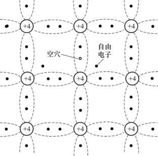
#### 杂质半导体
本征半导体空穴和自由电子数量极少，导电性能低，靠加热提高导电能力不现实，故选择掺入少量杂质（某种元素）
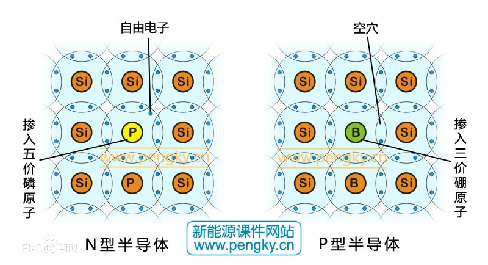
##### N型半导体 negative 负
在半导体中掺入磷P（其他五价元素），导致半导体中自由电子的数目大量增加，自由电子导电能力增强。
- 在N型半导体中，自由电子数目远大于空穴的数目，属于多数载流子，空穴属于少数载流子。

##### P型半导体 positive 正 
在半导体中掺入硼B（其他三价元素），导致半导体中空穴的数目大量增加，空穴导电能力增强。

##### PN结
在P型半导体和N型半导体的交界面形成一个特殊的薄层，称为PN结。
扩散运动形成PN结
漂移运动
- 单向导电性：当P接正N接负时，内电场减小，空间电荷区由于自由电子不断从N向P扩散，空穴从P向N扩散变窄，最终自由电子进入P区不断流出，空穴进入N区不断流出，即导通。
- 反向击穿性：在N端接正向电压，P端接负极，这样电压从N到P与内电场的方向一致，内电场增强，自由电子不断向N区域流动，空间电荷区不断变宽，如果不做限流处理最终将导致无法承受大量的自由电子涌入最终PN结烧毁。

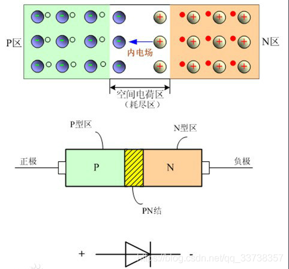

**加电阻可限制电流，防止短路**

雪崩击穿：掺杂浓度低，随着反向电压的提高，空间电荷区内电场增强，自由电子与空穴在电场作用下能量增大，撞出其他价电子，其他价电子又撞出更多价电子，载流子数目雪崩式增加，反向电流急剧增大。

齐纳击穿：掺杂浓度高，随着反向电压的提高，空间电荷区内建立很强的电场，直接将束缚在共价键中的价电子拉出来，产生大量的电子一空穴对，形成较大的反向电流，产生击穿。

雪崩击穿，温度越高，所需电压越大
齐纳击穿，温度越高，所需电压越小

击穿——>电流增大——>电功率增大——>温度升高——>热击穿（二次击穿）——>PN结烧毁（烧断、变导体）

### 二极管
工作在正向导通区
二极管与PN结相比，多了体电阻，电流比PN结小
反向电流大一些
#### 基本结构
点接触：PN结结面面积小，通过电流低，适用于高频和小功率的工作
面接触：结面面积大，可通过大电流，工作频率低，整流
平面型：大功率整流管和开关

#### 伏安特性
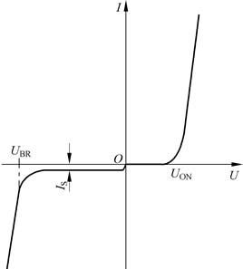
**正向特性**
-  特性曲线的右半部分称为正向特性，由图可见，当加二极管上的正向电压较小时，正向电流小，几乎等于零。
-  正向电压到达某一数值Uon时，正向电流才明显增大。导通时的正向**压降**，一般硅二极管的死区电压为0.7V左右，锗二极管的死区电压为0.2V左右。死区电压的产生是因为内电场的存在。
-  由正向特性曲线可见，流过二极管的电流有较大的变化，二极管两端的电压却基本保持不变。

**反向特性**
- 当二极管加反向电压，反向电流很小，而且反向电流不再随着反向电压而增大，即达到了饱和，这个电流称为反向饱和电流，用符号IS表示。
- 如果反向电压继续升高，当超过UBR以后，反向电流急剧增大，这种现象称为击穿，UBR称为反向击穿电压。
- 击穿二极管后不再具有单向导电性。应当指出，发生反向击穿不意味着二极管损坏。实际上，当反向击穿后，只要注意控制反向电流的数值，不使其过大，即可避免因过热而烧坏二极管。当反向电压降低后，二极管性能仍可能恢复正常。

**温度影响**
温度升高，正向特性左移，反向特性下移；室温附近，温度每升高1℃；正向压降减少2-2.5mV；室温附近，温度每升高10℃，反向电流增大一倍。
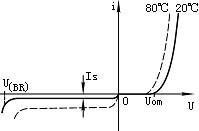

#### 主要参数
- **最大整流电流(I_F)**：二极管长期运行时，允许通过的最大正向平均电流。
- **反向工作峰值电压(V_RWM)**：保证二极管不被击穿而给出的反向峰值电压，一般是反向击穿电压的一半或三分之二。
- **反向峰值电流(I_RM)**：二极管上加反向工作峰值电压时的反向电流值，反向电流越小，说明二极管的单向导电性越好。反向饱和电流受温度影响大。
### 稳压二极管
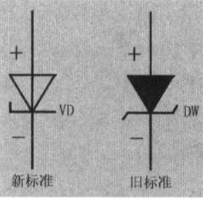
#### 工作原理
稳压二极管的特点就是击穿后，其两端的电压基本保持不变。
- 正向偏置状态：此状态下，稳压二极管的特性表现为普通二极管的特性，即：随着正向偏压的提高，正向电流变化很大、很陡！但由于Vf（0.3V~0.7V左右）很小，此正向偏置状态基本无使用价值。需要注意的是，不同的稳压二极管的正向压降是不同的。
- 反向偏置状态：此状态下，当反向电压没达到Vz之前，稳压二极管基本没导通；而当反向偏压接近Vz值时，稳压二极管开始导通，产生Ir电流。随着反向偏压的提高，反向电流Ir也会激烈变化得很大、很陡！**尽管电流在很大的范围内变化，而二极管两端的电压却基本上稳定在击穿电压附近，从而实现了二极管的稳压功能**。图中的黄色区域（击穿区）就是稳压二极管的正常工作状态，通常此区域对应的Vr区间范围很小，此电压就是稳压二极管的工作点、稳压值。
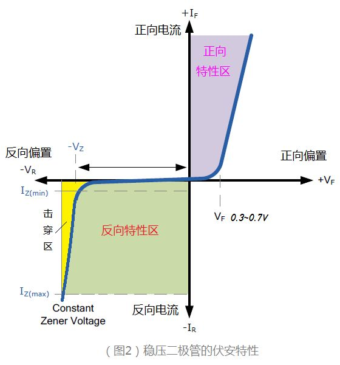
#### 主要参数
- 稳定电压（Uz）：稳压二极管正常工作下管子两端电压。
- 稳定电流（Iz）：工作电压等于稳定电压时的反向电流。稳压二极管的工作电流偏小，稳压效果就会变差，而电流过大，又会导致管体由于温度过高而损坏。对于每一个型号的稳压二极管，都规定有一个最大稳定电流Izm。
- 动态电阻（Rz）：电压变化量与电流变化量的比值，叫做稳压二极管的动态电阻。该比值随工作电流的不同而改变，一般是工作电流愈大，动态电阻则愈小。可见稳压二极管的动态电阻越小，说明稳压管的性能越好。
- 最大耗散功率（Pzm）：稳压管的最大功率损耗取决于PN结的面积和散热等条件。反向工作时，PN结的功率损耗为：Pz=Vz*Iz，由Pzm和Vz可以决定Izmax。
- 温度系数（aU）：稳压值受温度变化影响的系数。

### 三极管
半导体三极管又称为双极结型晶体管 BJT （Bipolar Junction Transistor），它是一种具有电流放大作用的流控器件。
#### 基本结构
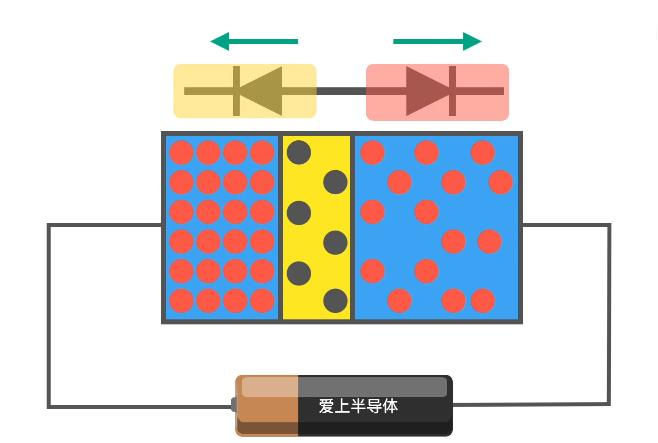
- 发射极（e）、集电极（c）、基极（b）
  
三极管是两个背对背的PN结组成，可以是NPN组合，也或以是PNP组合，**内部发射区高掺杂，基区很薄掺杂低，集电结面积大**。
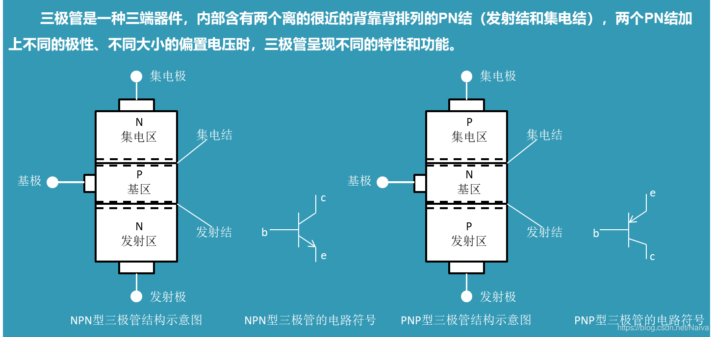
- B区（基极）很薄，掺杂浓度低，为了让发射区的自由电子更容易进入集电区。
- E区（发射区）掺杂浓度高，为了保证有足够多的自由电子进入BC区。

#### 工作原理
三极管的核心功能：
- 放大功能：小电流微量变化，在大电流上放大表现出来；
- 开关功能：以小电流控制大电流的通断。

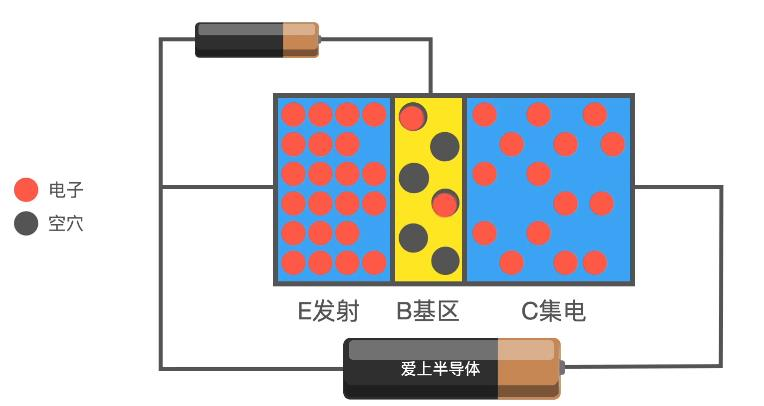
由于三极管类似于两个二极管背对背接，所以简单在发射极和集电极接电源不能导通，需要在发射极和基极之间再接一个电源。
- 在BE间电压的带动下，E区的自由电子源源不断流向B区。然而B区掺杂浓度很低且B区很薄，基区短时间内吸收不了这么多电子，只有一少部分电子与空穴复合形成基极电流，而大部分被吸引到了C区，形成集电极电流。
- 基极电流越大，流到基区的自由电子越多，更多的自由电子流向集电极，形成更大的集电极电流。这就是三极管小电流控制大电流的原理。

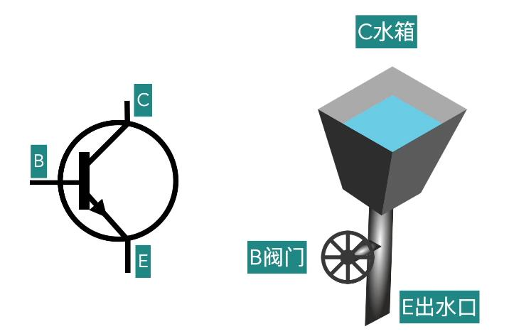
- **箭头为PN结方向**
#### 工作状态
**截止状态**
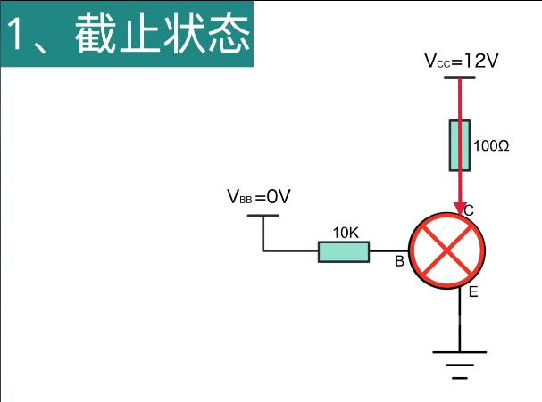
- Vb电压为0时，基极与发射极正向偏置，自由电子由B到E，三极管处于截止状态。

**饱和状态**
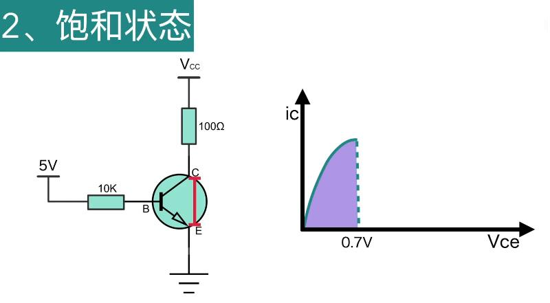
- Vb电压保持不变，逐渐加大Vc的电压，此时Vce和Ic随着Vc的增加而增加，在Vce小于0.7V之前，Vb大于Vc点电势之前，三极管都处于饱和状态。

**放大状态**
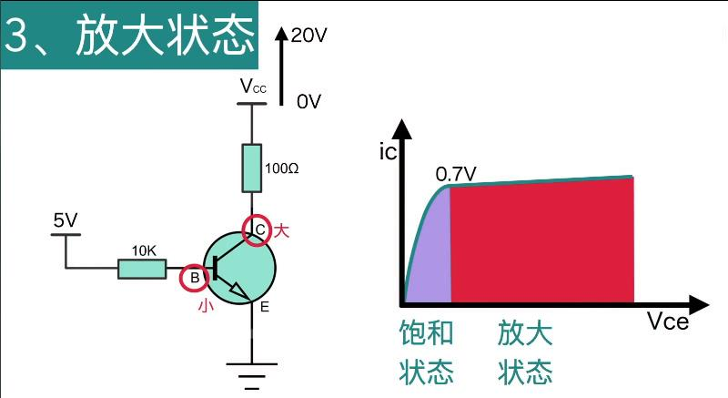
- 继续增加Vc，此时Vc电势大于Vb，在此期间，Vce变化加剧，而Ic几乎保持不变，此时Ic大约为Ib的100~200倍，处于三极管的放大状态。
- 通过控制Ib的小电流，从而控制Ic的大电流，控制Vce的电压。

**击穿状态**
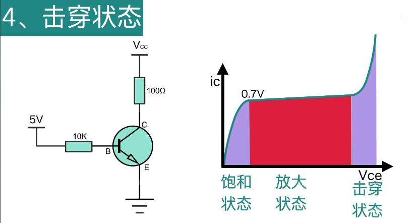
- Vc加的过大，三极管会瞬间击穿，造成永久损坏。

#### 主要参数
- 电流放大系数hfe
- 集电极最大允许电流Icm、最大允许功率Pcm
- 集-射极反向击穿电压Vceo：基极开路时，加在集电极和发射极之间的最大允许电压。
- 集-射极反向截止电流Iceo
- 集-基极反向截止电流Icbo

### 场效应晶体管
场效应晶体管（FET）是一种单极器件，仅使用一种电荷载体传导电流。如果基于N型半导体器件，则载流子为电子。相反，基于P型的器件仅使用空穴。
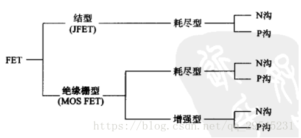
一般分为**结型场效应管**和**绝缘栅型场效应管**
绝缘栅型场效应管又分为**增强型**和**耗尽型**
#### 工作原理
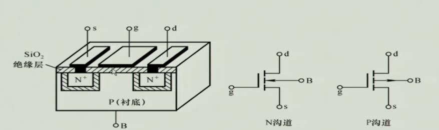
- 栅极（g）、源极（s）、漏极（d）
- 一般栅极和漏极与电源正极相连

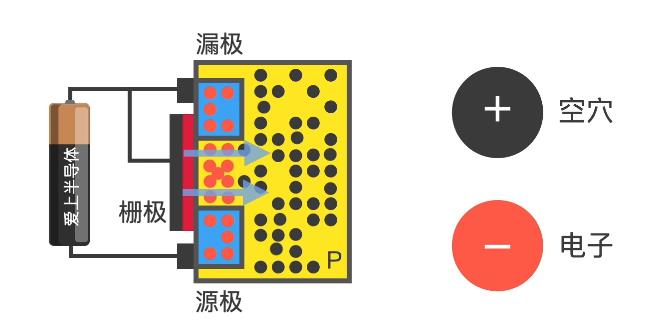
给栅极接上电，金属隔板上有电场，吸引P区自由电子到绝缘层，形成N沟道，使得漏极与源极导通。
#### 工作区域
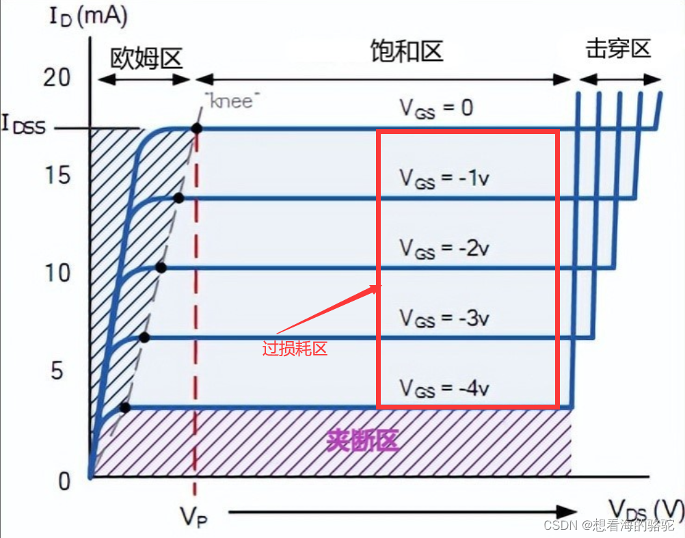
**可变电阻区**
当栅极电压逐渐增大，漏极电压不变，此时沟道电阻逐渐增大。
**恒流区**
栅极电压不变，漏极电压逐渐增大，当栅极电压-源极电压=开启电压（形成沟道的栅极电压），此时沟道发生**预夹断**，继续加大漏极电压，漏极电流几乎不变。
**击穿区**
## 放大电路
小功率信号变成一个大功率信号，需要一个核心器件（三极管）做这件事，核心器件的能量由电源提供，通过核心器件用小功率的信号去控制大电源，来实现能量的转换和控制，前提是不能失真，可以用一系列正弦波进行观测。
- 电子电路放大的基本特征：功率放大 （即不单是电流或是电压）
- 放大电路的本质：能量的控制和转换
- 放大电路中必要条件：有源元件（能够控制能量）
- 放大的前提条件：不失真（只有在不失真的情况下的放大才有意义）
- 放大电路核心元件：晶体管（工作在放大区）和场效应管（工作在恒流区）
- 测试信号：正弦波（任何稳态信号都可以分解为若干频率正弦信号）

### 基本共射放大电路
**有效放大条件**
- 静态：静态工作点要设置合适（直流电源、合适的电阻），使晶体管始终工作在**放大区**，静态工作点位置直接影响放大信号是否失真，是否能得到最大幅度的放大
- 动态：要保证实现信号的耦合（交流信号必须能够输入、传递到放大电路中，且**放大后的交流信号能够对外输出**、传递给负载或后级电路）

**基本结构**
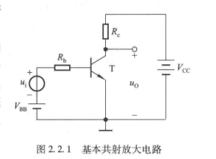
- 直流源VBB：产生小信号的交流源Ui本身很小，不能使发射结导通，所以单有Ui时，iB=0，需要加直流源VBB先导通发射结，与此同时产生了附着在直流IB上的变化的ib。
- 直流源VCC：放大电路的能源，并保证集电结反偏。
- 晶体三极管：工作在放大区（发射结正偏，集电结反偏）控制Vcc所提供的能量
- 电阻Rb：限流，防止电流过大将器件烧坏
- 电阻Rc：将电流信号变换为电压信号
- 加耦合电容：过滤直流分量，获得纯的放大的交流电压信号（隔直通交）
- 放大电压：反相，集电极电阻的存在

**直接耦合**
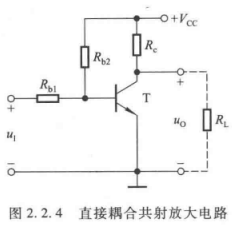
**阻容耦合**
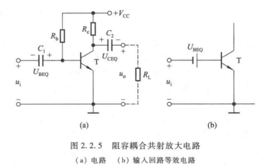

### 三种放大电路
**共射放大电路**
发射极是输入、输出的公共端
**共集放大电路**
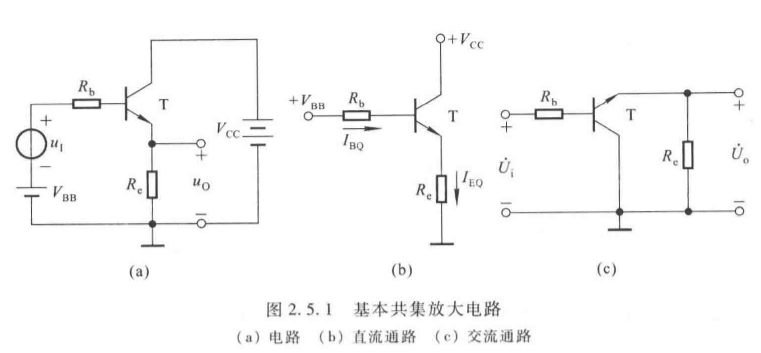
**共基放大电路**
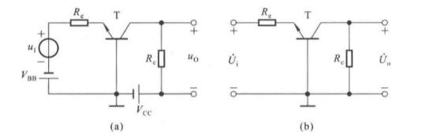
### 放大电路分析方法
先静态，后动态，动态参数与Q点密紧密相关，只有Q点合适，动态分析才有意义
#### 静态分析（图解法）
**直流通路和交流通路**
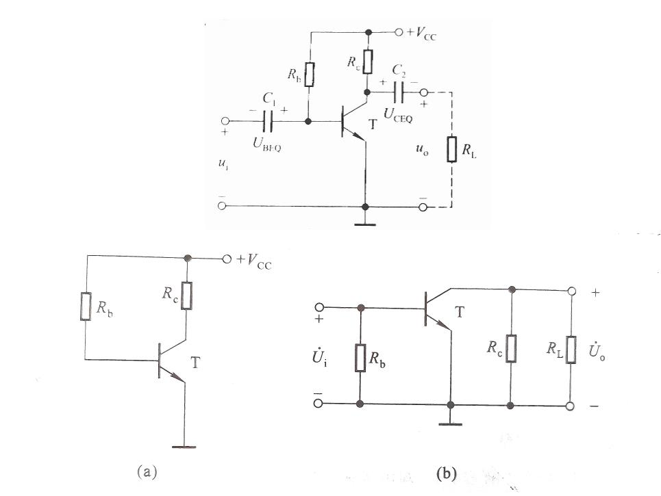
直流通路：交流源置零（短路）；电容断路
交流通路：直流源置零（接地、短路）；电容短路
**输入输出曲线**
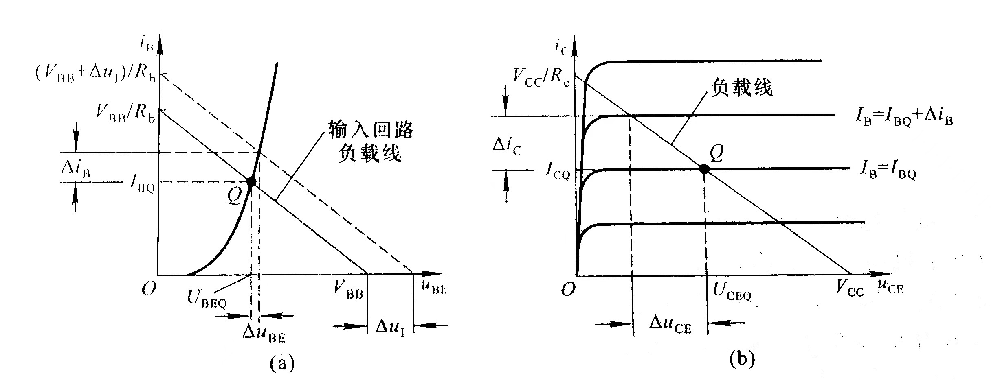
- 静态工作点Q影响放大能力
- 电压放大倍数Au=△uCE/△ui=△uo/△ui
- △iB从△ui中得出，△iC和△uCE从△iB得出，所以△ui的数值越大，晶体管的非线性特性对分析结果的影响越大。
- Ieq = Ibq + Ic， Ic = β * Ibq， Ibq = （Vcc - Ubeq）/ Rb

#### 动态分析
**微变等效电路**
把非线性元件晶体管所组成的放大电路等效为一个线性电路。
- 线性化的条件，就是晶体管在小信号（微变量）情况下工作。
- 晶体管输入电阻r_be
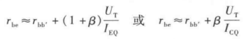
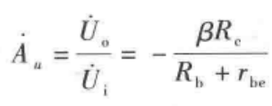
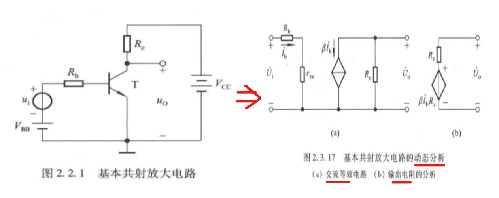